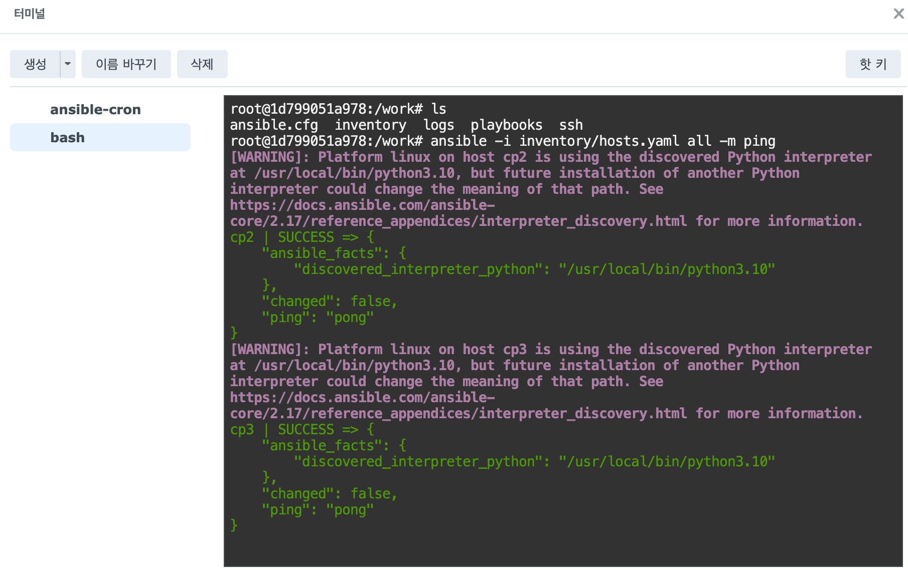

# 인증서 자동 갱신(컨테이너 환경)

- 사용한 툴 : Ansible + Supercronic

## 목표

- Docker 컨테이너에서 아래의 내용을 실행
  - 쿠버네티스 인증서 갱신을 위한 Ansible Playbook을 실행
  - Supercronic으로 ansible 스케줄(크론)을 실행하여 매월 로그 기록
  - 365일을 초과하는 로그는 삭제

## 컨테이너 기반 실행 배경

- 기존 환경은 인증서를 일자를 관리하지 않아 사내에서 사용하는 클러스터들의 인증서가 만료되는 일이 많았음
- 인증서 갱신 작업을 특정 서버에서 직접 실행하는 방법으로 구성하였으나, 서버 의존적인 실행보단 서버 외부 환경인 NAS의 Container Manager를 활용하여 Ansible 작업을 컨테이너로 실행하는 구조로 전환
- 이를 통해 특정 서버에 종속되지 않고, 매월 초 정기적으로 Kubernetes 인증서 갱신 및 상태를 자동으로 점검할 수 있는 독립적인 실행 환경을 구성

## 사전 준비 개요

- 컨테이너는 실행 환경에서의 원격 서버(Kubernetes Control Plane)에 대한 SSH 접근 권한과 신뢰 관계는 사전에 구성되어 있어야됨
- 자동화 환경에서의 대화형 입력이 불가능하므로, 준비가 선행되지 않으면 Ansible 작업은 실패함

### 사전에 필요한 파일

**SSH 관련 파일**

- `id_ed25519`
  - 필수
  - 컨테이너가 원격 서버에 SSH로 접속할 때 사용하는 개인 키
  - **주의** : 개인 키는 절대 Git 저장소에 포함하지 말 것
- `known_hosts`
  - 필수
  - 원격 서버 Host Key 사전 등록 파일
- `id_ed25519.pub`
  - 선택
  - 공개 키로 키 배포 및 추적용도

**SSH 관련 환경 구성 및 파일 생성**

- 호스트(서버)에서 키 생성 및 키 배포
  ```bash
  ssh-keygen -t ed25519
  ssh-copy-id root@inventry/hosts.yaml에 정의된 control plane 서버들의 IP
  ```
- known_hosts 등록
  - SSH 최초 접속 시 발생하는 신뢰 여부 확인 프롬프트를 사전에 제거하기 위함(Are you sure you want to continue connecting (yes/no)?)
  ```bash
  ssh-keyscan -H inventory/hosts.yaml에 정의된 control plane 서버들의 IP >> ./known_hosts
  ```

**Ansible 실행 관련 파일**

- [renew-kubeadm-certs-container.yaml](./playbooks/renew-kubeadm-certs-container.yaml)
  - 필수
  - 인증서 갱신/점검 Ansible 플레이북
- [hosts.yaml](./inventory/hosts.yaml)
  - 필수
  - Kubernetes Control Plane 노드 정보

## 커스텀 이미지 생성

### Dockerfile 작성

- [Dockerfile](./src/Dockerfile)
  - ansible-core를 실행하기 위한 python 런타임이 제공되며 가벼운 slim 이미지를 베이스로 생성
  - `DEBIAN_FRONTEND=noninteractive`로 apt 설치 시 질문 없이 자동 진행
  - `PYTHONDONTWRITEBYTECODE=1`로 .pyc 파일 생성 방지
  - `PYTHONUNBUFFERED=1`로 로그가 즉시 stdout으로 출력되게 설정
  - [supercronic-linux-amd64 설치 참고](https://github.com/aptible/supercronic/releases)
  - 패키지 설치
    - `openssh-client` : Ansible SSH 접속
    - `ca-certificates` : HTTPS 통신
    - `curl` : Supercronic 다운로드
  - `rm -rf /var/lib/apt/lists/*` 로 이미지 용량 최소화
  - 작업 디렉토리를 /work로 지정하고 이 경로에 playbooks/와 inventory/ ssh/ 디렉토리를 볼륨으로 마운트
- [entrypoint.sh](./src/entrypoint.sh)
  - 필수
- [crontab](./src/crontab)
  - 필수
  - Supercronic에서 사용할 실행 스케줄 정의
  - 매월 1일 3시 10분에 ansible-2026-01.log 형태로 로그를 남기고 365일 초과 로그는 자동 삭제

### 이미지 빌드

- 현재 디렉토리 파일 확인 및 이미지 빌드

  ```bash
  tree .
  .
  ├── crontab
  ├── Dockerfile
  └── entrypoint.sh

  1 directory, 3 files

  docker build -t ansible-cron:1.0 .

  # 이미지 확인
  docker images | grep ansible-cron
  ```

## 컨테이너 실행 및 playbook 동작 테스트

- 컨테이너 실행 및 접속

  ```bash
  # ansible-cron 컨테이너 실행
  docker run -d \
    --name ansible-cron \
    --restart unless-stopped \
    -v /root/ansible/playbooks:/work/playbooks:ro \
    -v /root/ansible/inventory:/work/inventory:ro \
    -v /root/ansible/ssh:/work/ssh:ro \
    ansible-cron:1.0

  # 컨테이너 상태 확인
  docker ps

  # 컨테이너 로그 확인
  docker logs --tail 200 ansible-cron

  # 컨테이너 접속
  docker exec -it ansible-cron bash
  ```

- 컨테이너 내부에서 ansible 실행 확인

  ```bash
  ansible-playbook -i inventory/hosts.yaml playbooks/renew-kubeadm-certs-container.yaml

  # crontab 설정 확인
  cat /etc/crontab
  ```

- ansible-cron 컨테이너 삭제
  ```bash
  docker rm -f ansible-cron
  ```

## Crontab 환경에서의 문제

- shell 환경에서는 문제없이 실행됐지만 crontab에 정의된 대로 Supercronic으로 cron 환경에서 실행 시 아래와 같은 에러 발생
  ```bash
  ERROR! [DEPRECATED]: community.general.yaml has been removed. The plugin has been superseded by the option `result_format=yaml` in callback plugin ansible.builtin.default from ansible-core 2.13 onwards. This feature was removed from community.general in version 12.0.0. Please update your playbooks.
  ```

### 해결 방법

- ansible.cfg 환경 정의 및 cron 실행 환경에 환경변수로 추가
- ansible 기본 설정 파일 정의 후 컨테이너 내부의 /work 경로에 위치되게끔 이미지 수정
  ```bash
  vi ansible.cfg
  ```
  ```bash
  [defaults]
  stdout_callback = ansible.builtin.default
  result_format = yaml
  ```
- crontab 파일에 환경변수 추가

  ```bash
  SHELL=/bin/sh
  PATH=/usr/local/sbin:/usr/local/bin:/usr/sbin:/usr/bin:/sbin:/bin

  # ansible 환경 변수 추가
  ANSIBLE_CONFIG=/work/ansible.cfg

  10 3 20 * * cd /work && /usr/local/bin/ansible-playbook -i inventory/hosts.yaml playbooks/renew-k8s-certs.yaml >> /work/logs/ansible-$(date +\%Y-\%m).log 2>&1 ; find /work/logs -name "ansible-*.log" -type f -mtime +365 -delete
  ```

## NAS 환경에서의 실행

- NAS에 이미지 업로드
  - 서버에서 이미지 압축 후 NAS의 `Container Manager > 이미지 > 작업 > 가져오기 > 파일에서 추가 > 로컬 장치에서` 로 이미지 업로드

  ```bash
  # 이미지 압축
  docker save k8s-cert-renew:0.1 -o k8s-cert-renew_0.1.tar
  ```

- NAS의 File Station에서 프로젝트 볼륨(예: `/volume1/docker/k8s-cert-renew`)에 `inventory/`, `playbooks/`, `ssh/` 디렉토리 생성 및 파일 위치

  ```bash
  $ pwd
  /volume1/docker/k8s-cert-renew
  $ ls
  inventory playbooks ssh

  $ ls inventory
  hosts.yaml

  $ ls playbooks
  renew-kubeadm-certs-container.yaml

  $ ls ssh
  id_ed25519.pub
  known_hosts
  ```

- NAS의 File Station의 프로젝트 볼륨에 `compose.yaml` 파일 업로드

  ```yaml
  version: "3.8"

  services:
    k8s-cert-renew:
      image: k8s-cert-renew:0.1
      container_name: ansible-cron
      restart: unless-stopped

      volumes:
        - /volume1/docker/k8s-cert-renew/playbooks:/work/playbooks:ro
        - /volume1/docker/k8s-cert-renew/inventory:/work/inventory:ro
        - /volume1/docker/k8s-cert-renew/ssh:/work/ssh:ro
  ```

- NAS의 Container Manager에서 프로젝트 생성 > File Station에서 생성한 경로 선택 > 생성
  - 컨테이너 탭에서 생성한 컨테이너 클릭 > 작업 > 터미널 열기 > 생성(bash) 클릭 시 터미널 접속 가능
  - 컨테이너에서 control plane 호스트로의 ping 통신 확인
    
