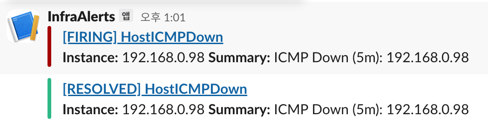

# blackbox-exporter alertmanager 연동

```css
[서버] ── ICMP ─▶ [Blackbox Exporter]
                         │
                         ▼
                    [Prometheus]
                         │
                  Alert Rule 트리거
                         │
                         ▼
                  [Alertmanager]
                         │
                         ▼
                      [Slack]
```

## slack webhook 설정

- slack webhook 값을 secret으로 생성
  ```bash
  kubectl -n monitoring create secret generic alertmanager-slack \
    --from-literal=slack_webhook_url='https://hooks.slack.com/services/T0xxx3/B0A8xxxUM26/mJoLxxxxxxODp'
  ```
- secret 마운트 확인
  ```bash
  $ k exec -it -n monitoring alertmanager-prometheus-stack-kube-prom-alertmanager-0 -- cat /etc/alertmanager/secrets/alertmanager-slack/slack_webhook_url
  https://hooks.slack.com/services/T0xxx3/B0A8xxxUM26/mJoLxxxxxxODp%
  ```

## PrometheusRule(알람 규칙) 생성

- `kube-prometheus-stack`에서의 `prometheus-operator`가 PrometheusRule을 감시하고 있다가, 변경/생성을 감지하면 Prometheus 설정(룰 파일)을 자동으로 갱신함
  - PrometheusRule에 헬름 릴리즈 라벨을 붙여야 됨(형태 예시 : release=prometheus-stack)

  ```bash
  # 헬름 릴리즈 라벨 확인
  $ kubectl -n monitoring get pod prometheus-stack-kube-prom-operator-6c79d6cd65-wvqf7 --show-labels | grep -i release
  prometheus-stack-kube-prom-operator-6c79d6cd65-wvqf7   1/1     Running   0          22h   app.... ,release=prometheus-stack

  # PrometheusRule 생성
  $ vi icmp-alerts.yaml
  ```

  ```yaml
  apiVersion: monitoring.coreos.com/v1
  kind: PrometheusRule
  metadata:
    name: icmp-alerts
    namespace: monitoring
    labels:
      release: prometheus-stack # helm 릴리즈 라벨
  spec:
    groups:
      - name: icmp.rules
        rules: # 알람 규칙 정의
          - alert: HostICMPDown
            expr: probe_success == 0 # blackbox exporter가 노출하는 메트릭(1 : ping ok, 0 : ping fail)
            for: 5m # 조건(probe_success == 0) 이 5분 동안 연속으로 유지될때만 알람 발생
            labels:
              severity: critical # 알림 라벨(따로 정해진 형태는 없으나 critical, warning, info를 많이 씀)
            annotations: # 사람이 읽는 설명용 텍스트로 slack, 이메일, grafana UI에 표시됨
              summary: "ICMP Down (5m): {{ $labels.instance }}"
              description: "{{ $labels.instance }} 가 5분 이상 ICMP 응답이 없습니다."
  ```

## alertmanager Rule 생성

- kube-prometheus-stack-72.1.0 차트를 사용하지만 values.yaml 파일이 유실되어 get values로 가져온 파일과 alertmanager.yaml 모두 적용하는 방식으로 업그레이드
  - 여러 개의 values.yaml 파일을 적용할 경우 순차적으로 적용되고 뒤의 values.yaml 파일이 덮어씌워지게 되는 구조로 동작

  ```bash
  # 기존 vlalues.yaml 파일 추출
  helm -n monitoring get values prometheus-stack -o yaml > prom-values.yaml

  # alertmanager 설정 파일 생성
  vi alertmanager.yaml
  ```

  ```yaml
  alertmanager:
    enabled: true

    alertmanagerSpec:
      secrets:
        - alertmanager-slack # 상단에서 만들어둔 slack webhook secret을 Alertmanager pod에 secret 마운트

    config:
      global:
        resolve_timeout: 5m

      route:
        # 기본은 버림(다른 알람이 Slack으로 전달되지 않게 설정)
        receiver: "null" # 매칭되지 않은 모든 알람은 null 리시버로 전달해서 버리게 됨
        group_by: ["alertname", "job", "instance"] # 같은 alertname + 같은 job + 같은 instance 조합을 하나의 묶음으로 처리
        group_wait: 30s # 첫 알람이 들어오면 바로 보내지 않고 30초 기다렸다가 묶어서 전송
        group_interval: 5m # 이미 한 번 보낸 그룹에 새 알람이 추가되면, 최소 5분 간격으로 묶음 업데이트를 전송
        repeat_interval: 3h # 같은 알람이 계속 firing 이면 3시간마다 리마인드(재전송)

        # ICMP 알람만 slack-icmp로 라우팅
        routes:
          - matchers:
              - alertname="HostICMPDown" # alertname 라벨이 HostICMPDown인 경우 slack-icmp로 보내고 그 외 알람은 상위 route의 receiver로 보냄(prometheusrule에서 알람이름과 일치해야됨)
            receiver: "slack-icmp"

      receivers:
        - name: "null"

        - name: "slack-icmp"
          slack_configs:
            - api_url_file: /etc/alertmanager/secrets/alertmanager-slack/slack_webhook_url # slack webhook url로 alertmanagerSpec.secrets으로 마운트한 secret 덕분에 참조됨
              channel: "#inf-alerts" # slack 채널
              send_resolved: true # 알람이 해결되면 RESOLVED 메시지도 전송
              title: "[{{ .Status | toUpper }}] {{ .CommonLabels.alertname }}" # [FIRING] HostICMPDown의 형태로 .Status는 firing 또는 resolved, .CommonLabels.alertname는 알람 이름
              # Alertmanager가 알람을 그룹으로 묶어서 보낼 수 있으며 그 그룹 안의 각 알람을 range .Alerts로 반복 출력
              text: >-
                {{ range .Alerts }} 
                *Instance:* {{ .Labels.instance }}
                *Summary:* {{ .Annotations.summary }}
                {{ end }}
  ```

- 적용
  ```bash
  helm upgrade -n monitoring prometheus-stack -f prom-values.yaml -f alertmanager.yaml .
  ```

## https alert rule 생성

- 기존 규칙에 생성

  ```yaml
  apiVersion: monitoring.coreos.com/v1
  kind: PrometheusRule
  metadata:
    name: blackbox-alerts
    namespace: monitoring
    labels:
      release: prometheus-stack
  spec:
    groups:
      - name: icmp.rules
        rules:
          - alert: HostICMPDown
            expr: probe_success == 0
            for: 5m
            labels:
              severity: critical
            annotations:
              summary: "ICMP Down (5m): {{ $labels.instance }}"
              description: "{{ $labels.instance }} 가 5분 이상 ICMP 응답이 없습니다."
          - alert: URLHTTPSDown
            expr: probe_success{job="blackbox-https"} == 0
            for: 5m
            labels:
              severity: critical
            annotations:
              summary: "URL Down (5m): {{ $labels.instance }}" # instance 라벨이 있는지는 prometheus 쿼리에서 확인 가능
  ```

  ```yaml
  alertmanager:
    enabled: true

    alertmanagerSpec:
      secrets:
        - alertmanager-slack

    config:
      global:
        resolve_timeout: 5m

      route:
        receiver: "null"
        group_by: ["alertname", "job", "instance"]
        group_wait: 30s
        group_interval: 1m
        repeat_interval: 1m

        # HostICMPDown과 URLHTTPSDOWN 은 slack-blackbox로 라우팅
        routes:
          - matchers:
              - alertname=~"HostICMPDown|URLHTTPSDown" # = 은 정확히 일치, =~는 정규식(OR 패턴)으로 매칭, HostICMPDown 또는 URLHTTPSDown
            receiver: "slack-blackbox"

      receivers:
        - name: "null"

        - name: "slack-blackbox"
          slack_configs:
            - api_url_file: /etc/alertmanager/secrets/alertmanager-slack/slack_webhook_url
              channel: "#infra-alerts"
              send_resolved: true
              title: "[{{ .Status | toUpper }}] {{ .CommonLabels.alertname }}"
              text: >-
                {{ range .Alerts }}
                *Instance:* {{ .Labels.instance }}
                *Summary:* {{ .Annotations.summary }}
                {{ end }}
  ```

  
