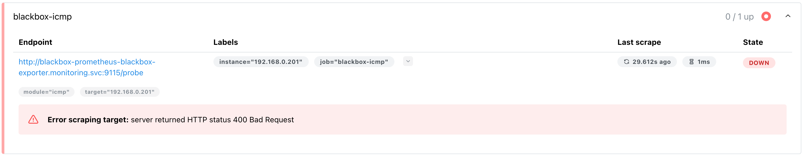
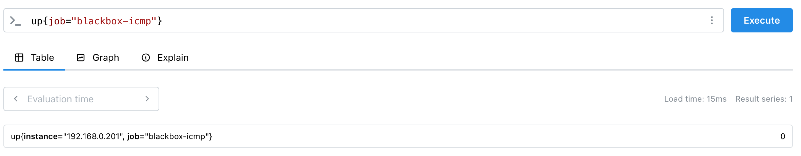
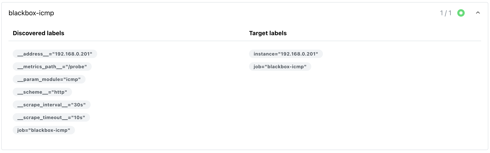

# blackbox-exporter

- Prometheus에서 외부 대상(서버, URL, 포트 등)을 사용자 관점에서 검사(probe)하기 위한 Exporter

## 체크 대상

- ICMP: ping 응답 여부
- HTTP/HTTPS: 응답 코드(200 등), 응답 시간, TLS 인증서 만료
- TCP: 특정 포트가 오픈 확인
- DNS: 도메인 질의가 정상 여부

## 동작 방법

- prometheus가 blackbox expoter에게 검사 대상 정보 전달 및 요청
- blackbox exporter가 외부 대상에 접속(probe)
- 결과를 메트릭 형태로 Prometheus에 변환

## 사용 시 장단점

장점

- 서버에 에이전트 설치가 불가능할 때도 사용 가능
- 설정이 단순

단점

- 내부 리소스(CPU, 메모리 등)는 알 수 없음
  - 위의 경우엔 node_exporter 사용

## 설치

### Blackbox exporter

- blackbox-exporter에서 모듈을 정의
- values.yaml 파일 수정

  ```yaml
  # ICMP 기능 사용 시 NET_RAW 권한 부여
  securityContext:
    runAsUser: 1000
    runAsGroup: 1000
    readOnlyRootFilesystem: true
    runAsNonRoot: true
    allowPrivilegeEscalation: false
    capabilities:
      drop: ["ALL"]
      # Add NET_RAW to enable ICMP
      add: ["NET_RAW"]

  config:
    modules:
      http_2xx: # 내부 / 일반 HTTP
        prober: http
        timeout: 5s
        http:
          valid_http_versions: ["HTTP/1.1", "HTTP/2.0"]
          follow_redirects: true
          preferred_ip_protocol: "ip4"
      ### 추가 ###
      https_2xx: # 외부 / 운영 HTTPS
        prober: http
        timeout: 5s
        http:
          tls_config:
            insecure_skip_verify: false
          valid_status_codes: [200, 301, 302]
      icmp_probe:
        prober: icmp
        timeout: 5s
      tcp_connect:
        prober: tcp
        timeout: 5s
      ######
  ```

- prometheus에서 어떤 모듈을 쓸지 선택
- Prometheus-stack/values.yaml 파일 수정

  ```yaml
  prometheus:
    prometheusSpec:
      additionalScrapeConfigsSecret:
        enabled: true
        name: additional-scrape-configs
        key: additional-scrape-configs.yaml
  ```

  ```bash
  vi blackbox-scrape-configs.yaml
  ```

  ```yaml
  - job_name: blackbox-icmp
    metrics_path: /probe
    params:
      module: [icmp]
    static_configs:
      - targets:
          - 192.168.0.201
    relabel_configs:
      - source_labels: [__address__]
        target_label: __param_target
      - source_labels: [__param_target]
        target_label: instance
      - target_label: __address__
        replacement: blackbox-prometheus-blackbox-exporter.monitoring.svc:9115

  - job_name: blackbox-https
    metrics_path: /probe
    params:
      module: [https_2xx]
    static_configs:
      - targets:
          - https://repo.domain.com
    relabel_configs:
      - source_labels: [__address__]
        target_label: __param_target
      - source_labels: [__param_target]
        target_label: instance
      - target_label: __address__
        replacement: blackbox-prometheus-blackbox-exporter.monitoring.svc:9115
  ```

- secret 생성

  ```bash
  kubectl create secret generic blackbox-scrape-configs \
    -n monitoring \
    --from-file=blackbox-scrape-configs.yaml

  helm upgrade prometheus-stack -n monitoring -f prom-values.yaml .
  ```

- Prometheus CR에 additionalScrape이 생겼는지 확인
  ```bash
  # additionalScrape가 확인
  $ kubectl -n monitoring get prometheus prometheus-stack-kube-prom-prometheus -o yaml | egrep -n "additionalScrape|blackbox"
  23:  additionalScrapeConfigs:
  24:    key: blackbox-scrape-configs.yaml
  25:    name: blackbox-scrape-configs
  ```

## Prometheus ICMP Target health 에러 해결



- prometheus UI의 Target health 에서 blackbox-icmp가 에러인 상태로 확인
- blackbox exporter 자체가 up 상태인지 확인

```promql
up{job="blackbox-icmp"}
```




- NET_RAW 권한 부여
- prometheus-blackbox-exporter/values.yaml 파일 수정
  ```yaml
  securityContext:
    runAsUser: 1000
    runAsGroup: 1000
    readOnlyRootFilesystem: true
    runAsNonRoot: true
    allowPrivilegeEscalation: false
    capabilities:
      drop: ["ALL"]
      # Add NET_RAW to enable ICMP
      add: ["NET_RAW"]
  ```
- 수정사항 반영
  ```bash
  helm upgrade blackbox -f values.yaml .
  ```
- 위의 권한 추가로 해결되지 않아 blackbox-exporter가 실행 중인 네임스페이스에서 직접 호출

  ```bash
  $ kubectl -n monitoring run -it --rm curl --image=curlimages/curl -- \
    curl -sS -v "http://blackbox-prometheus-blackbox-exporter.monitoring.svc:9115/probe?module=icmp&target=192.168.0.201" | head -n 40

  If you don't see a command prompt, try pressing enter.
  warning: couldn't attach to pod/curl, falling back to streaming logs: Internal error occurred: Internal error occurred: error attaching to container: failed to load task: no running task found: task
  ...
  * Request completely sent off
  < HTTP/1.1 400 Bad Request
  < Content-Type: text/plain; charset=utf-8
  < X-Content-Type-Options: nosniff
  < Date: Wed, 07 Jan 2026 03:15:18 GMT
  < Content-Length: 22
  <
  Unknown module "icmp" ##### icmp 모듈을 찾을 수가 없음!!!!!
  * Connection #0 to host blackbox-prometheus-blackbox-exporter.monitoring.svc:9115 left intact
  pod "curl" deleted
  ```

  -> icmp 모듈을 찾을 수 없어서 400 에러 발생

- 모듈명 확인 및 수정
  - blackbox-exporter에서 정의된 모듈명은 icmp_probe이고, scrape_configs에서 정의된 모듈명은 icmp여서 에러 발생
  ```bash
  vi blackbox-exporter/values.yaml
  ```
  ```yaml
  config:
    modules:
      http_2xx: # 내부 / 일반 HTTP
        prober: http
        ...
      https_2xx:       # 외부 / 운영 HTTPS
        prober: http
        ...
      icmp_probe:   ### 모듈명!!!
        prober: icmp
        timeout: 5s
  ```
- scrape_configs 모듈명 수정
  ```bash
  vi blackbox-exporter/scrape_configs.yaml
  ```
  ```yaml
  - job_name: blackbox-icmp
    metrics_path: /probe
    params:
      # module: [icmp] # 수정 전
      module: [icmp_probe] # 수정 후
    static_configs:
      - targets:
          - 192.168.0.201
    relabel_configs:
      - source_labels: [__address__]
        target_label: __param_target
      - target_label: __param_module
        replacement: icmp
      - source_labels: [__param_target]
        target_label: instance
      - target_label: __address__
        replacement: blackbox-prometheus-blackbox-exporter.monitoring.svc:9115
  ```
- probe_success 확인 시 1(정상)이 아닌 0(비정상)으로 확인
- 로그 확인
  ```bash
  $ kubectl -n monitoring logs deploy/blackbox-prometheus-blackbox-exporter --tail=200
  time=2026-01-07T06:03:15.516Z level=ERROR source=handler.go:135 msg="Probe failed" module=icmp_probe target=192.168.4.66 duration_seconds=0.000290962
  time=2026-01-07T06:03:16.662Z level=INFO source=handler.go:122 msg="Beginning probe" module=icmp_probe target=192.168.2.60 probe=icmp timeout_seconds=5
  time=2026-01-07T06:03:16.662Z level=INFO source=utils.go:61 msg="Resolving target address" module=icmp_probe target=192.168.2.60 target=192.168.2.60 ip_protocol=ip6
  time=2026-01-07T06:03:16.662Z level=INFO source=utils.go:130 msg="Resolved target address" module=icmp_probe target=192.168.2.60 target=192.168.2.60 ip=192.168.2.60
  time=2026-01-07T06:03:16.662Z level=INFO source=icmp.go:108 msg="Creating socket" module=icmp_probe target=192.168.2.60
  time=2026-01-07T06:03:16.662Z level=ERROR source=icmp.go:187 msg="Error listening to socket" module=icmp_probe target=192.168.2.60 err="listen ip4:icmp 0.0.0.0: socket: operation not permitted"
  time=2026-01-07T06:03:16.662Z level=ERROR source=handler.go:135 msg="Probe failed" module=icmp_probe target=192.168.2.60 duration_seconds=0.000376935
  time=2026-01-07T06:03:17.403Z level=INFO source=handler.go:122 msg="Beginning probe" module=icmp_probe target=192.168.4.22 probe=icmp timeout_seconds=5
  time=2026-01-07T06:03:17.404Z level=INFO source=utils.go:61 msg="Resolving target address" module=icmp_probe target=192.168.4.22 target=192.168.4.22 ip_protocol=ip6
  time=2026-01-07T06:03:17.404Z level=INFO source=utils.go:130 msg="Resolved target address" module=icmp_probe target=192.168.4.22 target=192.168.4.22 ip=192.168.4.22
  time=2026-01-07T06:03:17.404Z level=INFO source=icmp.go:108 msg="Creating socket" module=icmp_probe target=192.168.4.22
  time=2026-01-07T06:03:17.404Z level=ERROR source=icmp.go:187 msg="Error listening to socket" module=icmp_probe target=192.168.4.22 err="listen ip4:icmp 0.0.0.0: socket: operation not permitted"
  time=2026-01-07T06:03:17.404Z level=ERROR source=handler.go:135 msg="Probe failed" module=icmp_probe target=192.168.4.22 duration_seconds=0.000388417
  ...
  ```
- ip6관련 로그도 보이므로 설정에서 ip4로 고정하는 설정 추가
  ```yaml
  config:
    modules:
      http_2xx: # 내부 / 일반 HTTP
        prober: http
        timeout: 5s
        http:
          valid_http_versions: ["HTTP/1.1", "HTTP/2.0"]
          follow_redirects: true
          preferred_ip_protocol: "ip4"
      https_2xx: # 외부 / 운영 HTTPS
        prober: http
        timeout: 5s
        http:
          tls_config:
            insecure_skip_verify: false
          valid_status_codes: [200, 301, 302]
          preferred_ip_protocol: "ip4"
      icmp_probe:
        prober: icmp
        timeout: 5s
        icmp:
          preferred_ip_protocol: "ip4" #### 추가
  ```
- socket: operation not permitted 로그
  - 컨테이너에 NET_RAW가 적용됐는지 확인

  ```bash
  $ k get pods -n monitoring blackbox-prometheus-blackbox-exporter-58c8cdf5b4-f6tpg -o jsonpath='{.spec.containers[0].securityContext.capabilities}{"\n"}'
  {"add":["NET_RAW"],"drop":["ALL"]}
  ```

- blackbox-exporter에 wget, curl이 있는지 확인

  ```bash
  $ k exec -it blackbox-prometheus-blackbox-exporter-5b8577d774-pb5w2 -n monitoring -- sh -c 'which wget ||  true'
  /bin/wget
  ```

- blackbox-exporter파드의 wget으로 192.168.0.201 서버 확인

  ```bash
  $ kubectl -n monitoring exec -it $POD -- sh -c \
  'wget -qO- "http://127.0.0.1:9115/probe?module=icmp_probe&target=192.168.0.201" | head -n 30'

  # HELP probe_dns_lookup_time_seconds Returns the time taken for probe dns lookup in seconds
  # TYPE probe_dns_lookup_time_seconds gauge
  probe_dns_lookup_time_seconds 1.9613e-05
  # HELP probe_duration_seconds Returns how long the probe took to complete in seconds
  # TYPE probe_duration_seconds gauge
  probe_duration_seconds 0.000162667
  # HELP probe_icmp_duration_seconds Duration of icmp request by phase
  # TYPE probe_icmp_duration_seconds gauge
  probe_icmp_duration_seconds{phase="resolve"} 1.9613e-05
  probe_icmp_duration_seconds{phase="rtt"} 0
  probe_icmp_duration_seconds{phase="setup"} 0
  # HELP probe_ip_addr_hash Specifies the hash of IP address. It's useful to detect if the IP address changes.
  # TYPE probe_ip_addr_hash gauge
  probe_ip_addr_hash 3.551303026e+09
  # HELP probe_ip_protocol Specifies whether probe ip protocol is IP4 or IP6
  # TYPE probe_ip_protocol gauge
  probe_ip_protocol 4
  # HELP probe_success Displays whether or not the probe was a success
  # TYPE probe_success gauge
  probe_success 0
  ```

  - 400 에러나 Unknown module이 없는 것으로 봐서 /probe는 엔드포인트는 정상임
  - probe_ip_protocol 4 → IPv4로 probe 진행
  - probe_success 0 + probe_icmp_duration_seconds{phase="rtt"} 0 → ICMP 패킷이 실제로 왕복(RTT)하지 못함

- blackbox exporter 내부에서 ping 체크
  ```bash
  $ ping 192.168.0.200
  PING 192.168.0.200 (192.168.0.200): 56 data bytes
  ping: permission denied (are you root?)
  ```

  - 퍼미션 오류 확인
- blackbox-exporter/values.yaml 수정
  - user권한을 root로 변경
  - ICMP는 RAW 소켓 필요
    - non-root + CAP_NET_RAW(런타임/보안 모델상 실패)
    - root + CAP_NET_RAW로 성공

  ```yaml
  securityContext:
    # runAsUser: 1000 # 비활성화
    runAsUser: 0 # 추가
    runAsGroup: 1000
    readOnlyRootFilesystem: true # 파일시스템 보호
    # runAsNonRoot: true # 비활성화
    runAsNonRoot: false # 추가
    allowPrivilegeEscalation: false # setuid 차단
    capabilities:
      drop: ["ALL"] # 모든 capability 제거
      # Add NET_RAW to enable ICMP
      add: ["NET_RAW"] # ICMP에 필요한 것만 추가
  ```

- 상태 확인
  ```bash
  $ k exec -it -n monitoring blackbox-prometheus-blackbox-exporter-56d6b48fc8-4jhn6 -- sh -c \
  'wget -qO- "http://127.0.0.1:9115/probe?module=icmp_probe&target=192.168.0.201" | head -n 30'
  # HELP probe_dns_lookup_time_seconds Returns the time taken for probe dns lookup in seconds
  # TYPE probe_dns_lookup_time_seconds gauge
  probe_dns_lookup_time_seconds 3.2171e-05
  # HELP probe_duration_seconds Returns how long the probe took to complete in seconds
  # TYPE probe_duration_seconds gauge
  probe_duration_seconds 0.000839698
  # HELP probe_icmp_duration_seconds Duration of icmp request by phase
  # TYPE probe_icmp_duration_seconds gauge
  probe_icmp_duration_seconds{phase="resolve"} 3.2171e-05
  probe_icmp_duration_seconds{phase="rtt"} 0.000444023
  probe_icmp_duration_seconds{phase="setup"} 0.000135104
  # HELP probe_icmp_reply_hop_limit Replied packet hop limit (TTL for ipv4)
  # TYPE probe_icmp_reply_hop_limit gauge
  probe_icmp_reply_hop_limit 63
  # HELP probe_ip_addr_hash Specifies the hash of IP address. It's useful to detect if the IP address changes.
  # TYPE probe_ip_addr_hash gauge
  probe_ip_addr_hash 3.551303026e+09
  # HELP probe_ip_protocol Specifies whether probe ip protocol is IP4 or IP6
  # TYPE probe_ip_protocol gauge
  probe_ip_protocol 4
  # HELP probe_success Displays whether or not the probe was a success
  # TYPE probe_success gauge
  probe_success 1
  ```

  - probe_success 1로 정상적으로 수집됨을 확인
