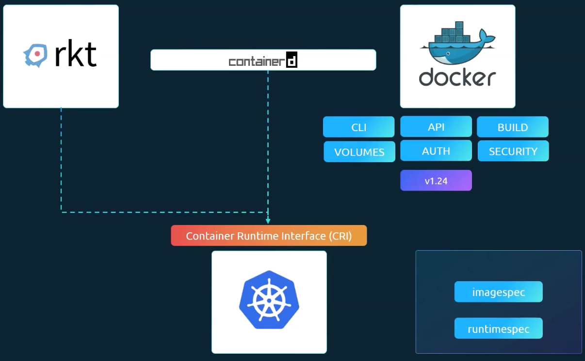

# Kubernetes Architecture
## Kubectl Command
- 클러스터에 대한 정보 확인
```bash
$ kubectl cluster-info
Kubernetes control plane is running at https://27.255.90.120:6443

To further debug and diagnose cluster problems, use 'kubectl cluster-info dump'.
```

## Docker vs Containerd


- Container Runtime Interface(CRI) 도입
	- CRI는 모든 벤더가 OCI 표준을 준수하는 한 Kubernetes의 컨테이너 런타임으로 동작할 수 있음
		- OCI(Open Container Initiative)
			- 이미지 스펙과 런타임 스펙으로 구성됨
				- Imagespec
					- 이미지를 작성하는 방법과 빌드하는 방법에 대한 표준
				- runtimespec
					- 컨테이너 런타임을 개발하는 방법에 대한 표준
- Docker
	- 가장 초기에 사용하던 컨테이너 런타임
	- 도커는 CRI 표준을 지원하도록 구축되지 않았으며 CRI가 도입되기 훨씬 전에 구축
	- 도커를 지원하기 위한 임시 방편으로 dockershim 사용
	- 1.24 버전부터 docker 자체는 kubernetes에서 지원되는 런타임에서 제거
- Conatinerd
	- ctr
		- ctr 커맨드는 디버깅 전용으로 만들어졌으며 제한된 기능만 지원
			- 사용자 친화적이지 않음
	```bash
	ctr images pull ~
	ctr run ~
	```
	- nerdctl
		- nerdctl은 docker 커맨드와 유사
			- docker가 지원하는 옵션의 전부 또는 대부분을 지원
		- docker command 대신 nerdctl을 사용하는 것이 가장 이상적
	```bash
	# docker
	$ nerdctl

	# docker run --name redis redis:alpine
	$ nerdctl run --name redis redis:alpine

	# docker run --name webserver -p 80:80 -d nginx
	$ nerdctl run --name webserver -p 80:80 -d nginx
	```
	- crictl
		- crictl은 cri 호환 컨테이너 런타임과 상호작용 하는데 사용되는 커맨드
		- 쿠버네티스 커뮤니티에서 개발하고 유지 관리함
		- 다른 도구들과 달리 모든 컨테이너 런타임에서 동작함
		- 디버깅 용도로 많이 사용
```bash
crictl
crictl pull busybox
crictl images
crictl ps -a
crictl exec -i -t container_id ls
crictl logs container_id
```

## Replication Controller vs ReplicaSet
### Replication Controller
- 구형 기술
### ReplicaSet
- replica를 설정하는 새로운 권장 방법
- Replication Controller와는 다르게 `slector` 항목이 추가되어 어떤 파드가 ReplicaSet에 해당되는지 식별하는데 도움이 됨
- 스케일 하는 3가지 방법
```bash
$ kubectl apply -f replicaset-definition.yml
$ kubectl replace -f replicaset-definition.yml
$ kubectl scale --replicas=6 -f replicaset-definition.yml
# type: replicaset, name: myapp-replicaset
$ kubectl scale --replicas=6 replicaset myapp-replicaset
```
## Namespace
- Switch Namespace
```bash
# default 네임스페이스에서 dev 네임스페이스로 이동
$ kubectl config set-context $(kubectl config current-context) --namespace=dev
```
### 리소스 쿼터 설정
```yaml
apiVersion: v1
kind: ResourceQuota
metadata:
  name: compute-quota
  namespace: dev
spec:
  hard:
    pods: "10"
    requests.cpu: "4"
    requests.memory: "5Gi"
    limits.cpu: "10"
    limits.memory: "10Gi"
```
## Service
### NodePort
- target port : 파드의 포트
- port : 서비스의 포트
```bash
apiVersion: v1
kind: Service
metadata:
  name: nginx
spec:
  type: NodePort
  ports:
  - port: 80
    targetPort: 80
    nodePort: 30008
  selector:
    app: nginx
```
```bash
kubectl expose pod nginx --port=80 --name nginx-service --type=NodePort --dry-run=client -o yaml

kubectl expose pod redis --port=6379 --name redis-service --dry-run=client -o yaml
```
## kubectl command
- kubectl api-resources
```bash
$ kubectl api-resources
NAME                                SHORTNAMES                APIVERSION                          NAMESPACED   KIND
bindings                                                      v1                                  true         Binding
componentstatuses                   cs                        v1                                  false        ComponentStatus
configmaps                          cm                        v1                                  true         ConfigMap
endpoints                           ep                        v1                                  true         Endpoints
events                              ev                        v1                                  true         Event
limitranges                         limits                    v1                                  true         LimitRange
```
- kubectl expalin [resource]
```bash
$ kubectl explain pod
KIND:       Pod
VERSION:    v1

DESCRIPTION:
    Pod is a collection of containers that can run on a host. This resource is
    created by clients and scheduled onto hosts.

FIELDS:
  apiVersion	<string>
    APIVersion defines the versioned schema of this representation of an object.
    Servers should convert recognized schemas to the latest internal value, and
    may reject unrecognized values. More info:
    https://git.k8s.io/community/contributors/devel/sig-architecture/api-conventions.md#resources

  kind	<string>

$ kubectl expalin pod.spec.container

# pod 리소스에서 사용할 수 있는 전체 필드 목록을 출력
$ kubectl explain pods --recursive | head -n 20
KIND:       Pod
VERSION:    v1

DESCRIPTION:
    Pod is a collection of containers that can run on a host. This resource is
    created by clients and scheduled onto hosts.

FIELDS:
  apiVersion	<string>
  kind	<string>
  metadata	<ObjectMeta>
    annotations	<map[string]string>
    creationTimestamp	<string>
    deletionGracePeriodSeconds	<integer>
    deletionTimestamp	<string>
    finalizers	<[]string>
    generateName	<string>

$ k explain service.spec.ports --recursive
KIND:       Service
VERSION:    v1

FIELD: ports <[]ServicePort>


DESCRIPTION:
    The list of ports that are exposed by this service. More info:
    https://kubernetes.io/docs/concepts/services-networking/service/#virtual-ips-and-service-proxies
    ServicePort contains information on service's port.
    
FIELDS:
  appProtocol   <string>
  name  <string>
  nodePort      <integer>
  port  <integer> -required-
  protocol      <string>
  enum: SCTP, TCP, UDP
  targetPort    <IntOrString>
```
