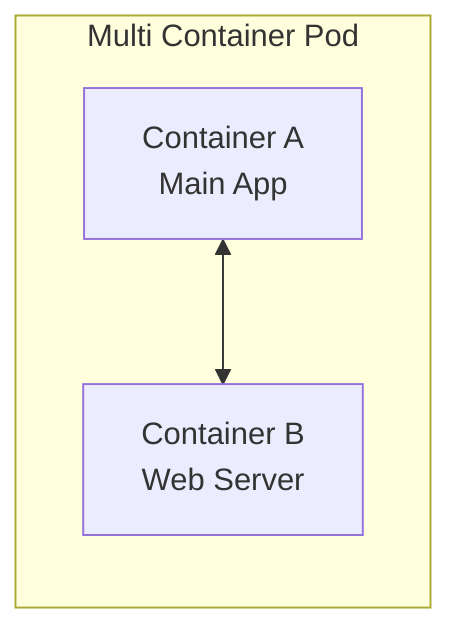
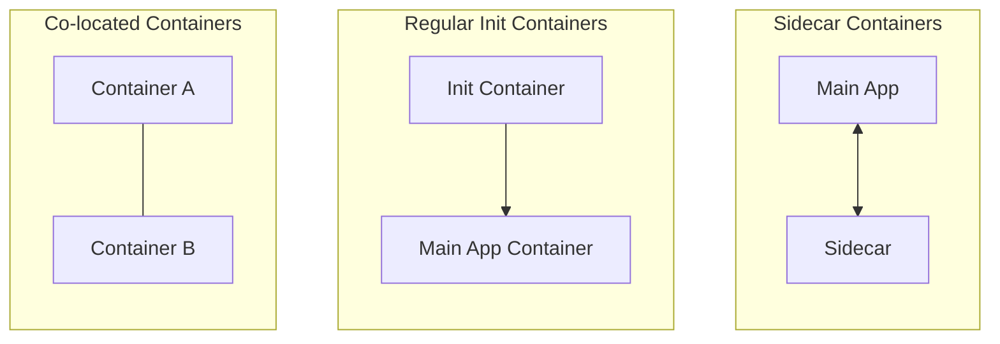

# Multi-Container Pods

- 대규모 모놀리식 애플리케이션을 마이크로 서비스라는 하위 구성요소로 분리하면 재사용 가능한 코드 세트를 개발 및 배포가 가능해짐



- 멀티 컨테이너 파드의 컨테이너들은 라이프 사이클을 함께함
- 같은 네트워크 공간을 공유하기 때문에 서로를 localhost라고 부를 수 있음
- 동일한 저장 공간에 접근이 가능

## 멀티 컨테이너 디자인 패턴



- Co-located
  - 같은 Lifecycle
  - 동등한 관계
  - 예: worker + helper
- Regular Init Containers
  - init Container는 먼저 실행
  - 완료 후 Main App 시작
  - init은 종료됨
  - 예: config 생성, 권한 설정
- Sidecar Containers
  - 동시에 실행
  - Main을 보조
  - 예: log agent, envoy, metrics exporter

### 멀티 컨테이너의 yaml 형태

- Co-located Containers
  - 두 개의 컨테이너의 시작 순서가 정해져 있지 않음
  ```yaml
  apiVersion: v1
  kind: Pod
  metadata:
    labels:
      run: simple-webapp
    name: simple-webapp
  spec:
    containers:
      - name: simple-webapp
        image: web-app
        ports:
          - containerPort: 8080
      - name: main-app
        image: main-app
  ```
- Regular Init Containers
  - initContainer의 db-checker와 api-checker가 먼저 실행되고, 종료 후 메인 컨테이너가 시작됨
  ```yaml
  apiVersion: v1
  kind: Pod
  metadata:
    labels:
      run: simple-webapp
    name: simple-webapp
  spec:
    containers:
      - name: simple-webapp
        image: web-app
        ports:
          - containerPort: 8080
    initContainers:
      - name: db-checker
        image: busybox
        command: "wait-for-db-to-start.sh"
      - name: api-checker
        image: busybox
        command: "wait-for-another-api.sh"
  ```
- Sidecar Containers
  - initContainer가 먼저 시작되고, 준비가 완료되면 메인 컨테이너가 시작됨
  - initContainer에 `restartPolicy` 정책이 항상으로 설정되어 있으므로 계속 실행됨-> ??
  ```yaml
  apiVersion: v1
  kind: Pod
  metadata:
    labels:
      run: simple-webapp
    name: simple-webapp
  spec:
    containers:
      - name: simple-webapp
        image: web-app
        ports:
          - containerPort: 8080
    initContainers:
      - name: log-shipper
        image: busybox
        command: "setup-log-shipper.sh"
        restartPolicy: Always
  ```
