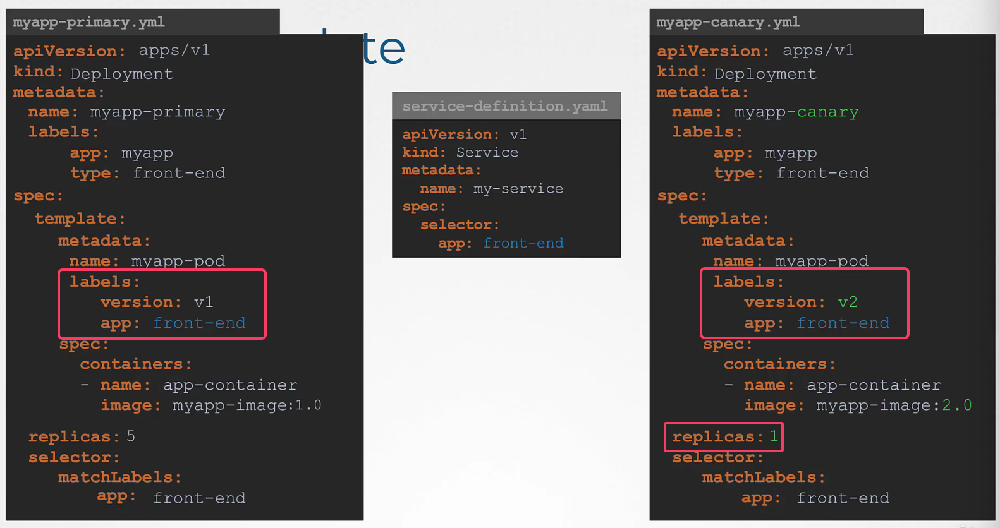
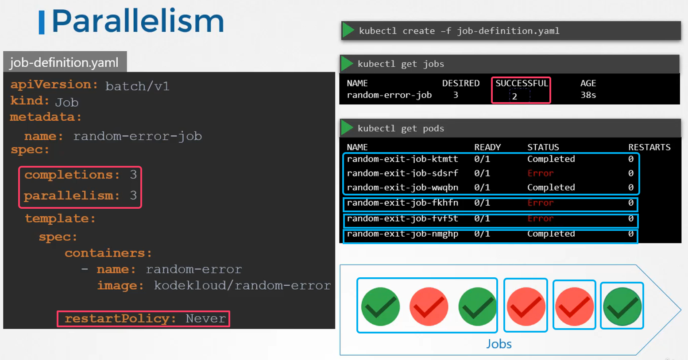

# Pod Design

## Labels

- labels selector

```bash
kubectl get pods --selector env=dev
kubectl get pods -l env=dev

k get pods -l env=prod,bu=finance,tier=frontend

```

## Rolling Updates & Rollbacks in Deployments

- Create

  ```bash
  kubectl create -f deployment-definition.yml
  ```

- Get

  ```bash
  kubectl get deployments
  ```

- Update

  ```bash
  kubectl apply -f deployment-definition.yml
  kubectl set image deloyment/myapp-deployment nginx=nginx:1.9.1
  ```

- Status

  ```bash
  kubectl rollout status deployment/myapp-deployment
  kubectl rollout history deployment/myapp-deployment
  ```

- Rollback

  ```bash
  kubectl rollout undo deployment/myapp-deployment
  ```

## Deployment Strategy

- Recreate
  - 모든 파드를 한번에 삭제 후 다시 생성
  - 애플리케이션이 다운되어 있는 동안 접속 불가능
- Rolling Update
  - Kubernetes Deployment의 기본 배포 전략
  - 기존 pod를 하나씩 교체하며 점진적으로 배포
- Blue/Green
  - 기존 버전(Blue)과 새 버전(Green)을 동시에 운영
  - 트래픽을 한 번에 Green으로 전환
  - 무중단 배포가 가능하지만 리소스를 2배로 사용
  - 이 전략은 istio와 함께 사용하는 것이 좋음
- Canary

  
  - 새 버전을 일부 사용자에게만 소량으로 배포
    - istio를 사용하여 파드로 트래픽되는 정확한 비율을 정의 가능
  - 문제가 없을 시 점차 트래픽 확대
  - 위험 최소화
  - 점진적 검증 가능

## Job

- 생성
  ```bash
  k create job job-name --image 이미지명
  ```
- Restart Policy
  - Job 안에서 실행되는 Pod가 실패했을 때 어떻게 할지 결정
  - OnFailure
    - 컨테이너가 실패(exit code != 0)하면 Pod 내부에서 다시 실행
    - 같은 Pod가 재시작됨(Pod가 새로 생성되지 않음)
  - Never
    - 실패해도 Pod를 재시작하지 않음
    - Job Controller가 새 Pod를 생성할 수는 있음
    - 실패한 Pod 기록을 남기고 싶을 때 유리
- Completions
  - Job이 총 몇 번 성공해야 완료되는지를 정의
  ```yaml
  # 총 3번 성공해야 완료
  completions: 3
  ```
- Parallelism(동시 실행 개수)
  - Job에서 동시에 몇 개의 Pod를 실행할지 정의

  

- 얼마나 실행했는지 확인
  - backofflimit을 30으로 설정, completions를 3으로 설정했을 때 몇 번 성공했고, 몇 번째 파드가 실행 중인지 확인
    - 성공 조건은 랜덤으로 주사위를 돌렸을 때의 값이 6인 경우만 성공

  ```bash
  # 3번 성공해야되는데, 2번 성공(파드의 출력값이 6인 경우)
  k get jobs.batch throw-dice-job
  NAME             STATUS    COMPLETIONS   DURATION   AGE
  throw-dice-job   Running   2/3           2m5s       2m5s

  # 13번째 파드가 실행 중(성공, 실패한 파드 모두를 포함)이므로, 아직 17번이 더 남음
  # 4는 마지막에 실행한 파드의 값이 4라는 의미
  $ k logs jobs/throw-dice-job
  Found 13 pods, using pod/throw-dice-job-kdj9p
  4
  ```

## cronjob

- 생성
  ```bash
  k create cronjob throw-dice-cron-job --image kodekloud/throw-dice --schedule='30 21 * * *'
  ```
