# Helm, Kustomize

## Helm

- Kubernetes 애플리케이션을 패키징하는 형식

  ```bash
  my-chart/
  ├── Chart.yaml          # 차트 메타데이터 (필수)
  ├── values.yaml         # 기본 설정값 (필수)
  ├── charts/             # 의존성 차트 디렉토리
  ├── templates/          # Kubernetes 매니페스트 템플릿
  │   ├── deployment.yaml
  │   ├── service.yaml
  │   ├── ingress.yaml
  │   ├── _helpers.tpl    # 재사용 가능한 템플릿 헬퍼
  │   ├── NOTES.txt       # 설치 후 출력 메시지
  │   └── tests/
  │       └── test-connection.yaml
  └── .helmignore         # 패키징 제외 파일 목록
  ```

- Chart.yaml
  - 차트 메타데이터(신원 정보)

  ```yaml
  apiVersion: v2
  name: my-chart
  description: A Helm chart for my app
  type: application # application 또는 library
  version: 0.1.0 # 차트 버전 (SemVer)
  appVersion: "1.0.0" # 앱 버전
  ```

- values.yaml
  - 기본 설정
  - 템플릿에 주입될 기본값

  ```yaml
  replicaCount: 1
  image:
    repository: nginx
    tag: "latest"
  service:
    type: ClusterIP
    port: 80
  ```

- template
  - Go 템플릿 문법으로 작성된 K8S 리소스

  ```yaml
  # deployment.yaml 예시
  spec:
    replicas: { { .Values.replicaCount } }
    containers:
      - image: "{{ .Values.image.repository }}:{{ .Values.image.tag }}"
  ```

- \_helpers.tpl
  - 반복 사용하는 템플릿 조각 정의

  ```yaml
  {{- define "my-chart.fullname" -}}
  {{ .Release.Name }}-{{ .Chart.Name }}
  {{- end }}
  ```

---

### 주요 내장 객체

| 객체            | 설명               | 예시                                  |
| --------------- | ------------------ | ------------------------------------- |
| `.Values`       | values.yaml의 값   | `.Values.image.tag`                   |
| `.Release`      | 릴리스 정보        | `.Release.Name`, `.Release.Namespace` |
| `.Chart`        | Chart.yaml 정보    | `.Chart.Name`, `.Chart.Version`       |
| `.Files`        | 차트 내 파일 접근  | `.Files.Get "config.ini"`             |
| `.Capabilities` | 클러스터 기능 정보 | `.Capabilities.KubeVersion`           |

---

### 차트 타입

- **application** — 일반적인 배포용 차트 (기본값)
- **library** — 다른 차트에서 재사용하는 헬퍼 템플릿 모음, 단독 설치 불가

---

### 동작 흐름 요약

```
values.yaml  ──┐
               ├──▶  Helm 렌더링  ──▶  Kubernetes 매니페스트  ──▶  클러스터 적용
templates/   ──┘
```

## Kustomize

- Kustomize는 템플릿 없이 순수 YAML을 오버레이 방식으로 커스터마이징 하는 Kubernetes 네이티브 도구(`kubectl` 1.14 부터 내장됨)

- 핵심 철학 : `Base` + `Overlay`
  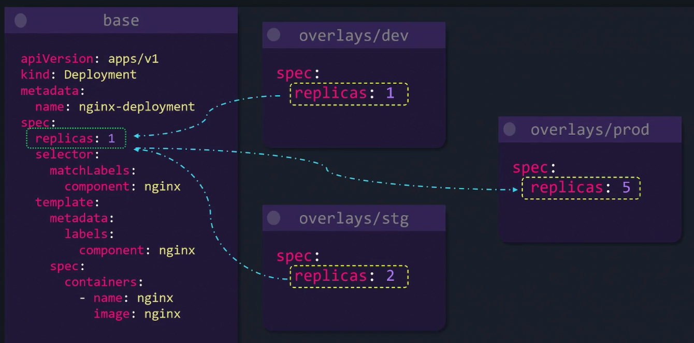

  ```bash
  k8s-config/
  ├── base/                    # 공통 기본 리소스
  │   ├── kustomization.yaml
  │   ├── deployment.yaml
  │   └── service.yaml
  │
  └── overlays/                # 환경별 커스터마이징
      ├── dev/
      │   ├── kustomization.yaml
      │   └── patch-replicas.yaml
      ├── staging/
      │   └── kustomization.yaml
      └── production/
          ├── kustomization.yaml
          └── patch-replicas.yaml
  ```

kustomization.yaml

- 핵심 파일
- base/kustomization.yaml

  ```yaml
  apiVersion: kustomize.config.k8s.io/v1beta1
  kind: Kustomization

  resources: # 포함할 리소스 목록
    - deployment.yaml
    - service.yaml
  ```

- overlays/production/kustomization.yaml

  ```yaml
  apiVersion: kustomize.config.k8s.io/v1beta1
  kind: Kustomization

  bases:
    - ../../base # base를 참조

  namePrefix: prod- # 모든 리소스 이름 앞에 접두사 추가
  namespace: production # 네임스페이스 일괄 변경

  replicas: # 레플리카 수 변경
    - name: my-app
      count: 5

  images: # 이미지 태그 변경
    - name: nginx
      newTag: "1.25.0"

  patches: # 세부 패치 적용
    - path: patch-replicas.yaml
  ```

- 패치 방식
  - Strategic Merge Patch - yaml 구조를 덮어쓰기

    ```yaml
    # patch-resources.yaml
    apiVersion: apps/v1
    kind: Deployment
    metadata:
      name: my-app
    spec:
      template:
        spec:
          containers:
            - name: my-app
              resources:
                limits:
                  memory: "512Mi"
                  cpu: "500m"
    ```

  - Json 6902 Patch - 경로 기반 정밀 수정

    ```yaml
    patches:
      - target:
          kind: Deployment
          name: my-app
        patch: |-
          - op: replace         # add / remove / replace
            path: /spec/replicas
            value: 5
    ```

### command

```bash
# 렌더링 결과 미리보기 (클러스터 적용 안 함)
kubectl kustomize overlays/production

# 클러스터에 적용
kubectl apply -k overlays/production

# 삭제
kubectl delete -k overlays/production
```

- build
  - k8s/ 디렉토리 안의 kustomization.yaml을 읽어서, 최종 렌더링된 Kubernetes 매니페스트를 stdout으로 출력하는 명령

    ```bash
    k8s/
    └── kustomization.yaml   ← 이 파일을 찾아서 읽음
        + 참조된 리소스들
            │
            ▼
      Kustomize 렌더링
            │
            ▼
      stdout으로 YAML 출력  (클러스터에 적용하지 않음)
    ```

  - k8s/kustomization.yaml

    ```yaml
    resources:
      - deployment.yaml
      - service.yaml

    commonLabels:
      env: production

    images:
      - name: nginx
        newTag: "1.25.0"
    ```

- 실행

  ```bash
  kustomize build k8s/
  ```

- 출력 결과(렌더링 된 최종 YAML)

  ```yaml
  apiVersion: apps/v1
  kind: Deployment
  metadata:
    name: my-app
    labels:
      env: production # commonLabels 적용됨
  spec:
    template:
      spec:
        containers:
          - name: my-app
            image: nginx:1.25.0 # 이미지 태그 적용됨
  ---
  apiVersion: v1
  kind: Service
  metadata:
    name: my-app
    labels:
      env: production # commonLabels 적용됨
  ```

- 클러스터에 바로 저장

  ```bash
  kustomize build k8s/ | kubectl apply -f -

  # kubectl 내장 명령으로 실행
  kubectl apply -k k8s/   # build + apply 한번에
  kubectl kustomize k8s/  # build만 (kustomize build k8s/ 와 동일)
  ```

### 여러 개의 디렉토리가 있는 경우

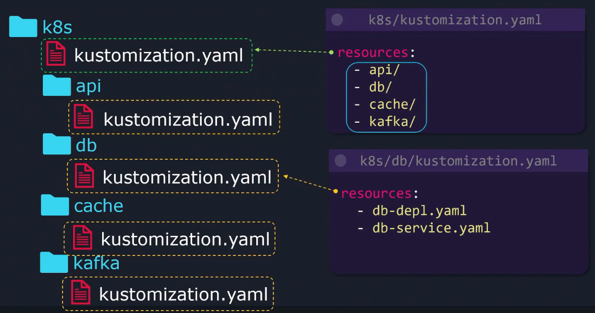

- 상위 kustomization.yaml에서 통합

  ```bash
  k8s/
  ├── kustomization.yaml    ← 여기서 하위 디렉토리를 모두 참조
  ├── app-a/
  │   ├── kustomization.yaml
  │   ├── deployment.yaml
  │   └── service.yaml
  ├── app-b/
  │   ├── kustomization.yaml
  │   └── deployment.yaml
  └── app-c/
      ├── kustomization.yaml
      └── deployment.yaml
  ```

- k8s/kustomization.yaml

  ```yaml
  resources:
    - app-a/
    - app-b/
    - app-c/
  ```

- 빌드 및 적용

  ```bash
  kustomize build k8s/ # 하위 디렉토리까지 한번에 렌더링

  kustomize build k8s/ | kubectl apply -f -
  kubectl apply -k k8s/
  ```

### Common Transformers

- Kustomize에서 모든 리소스에 공통적으로 변환을 적용하는 기능
- `commonLabels`
  - 모든 리소스에 라벨 추가

  ```yaml
  # kustomization.yaml
  commonLabels:
    app: my-app
    env: production
    team: backend
  ---
  # 적용 결과
  metadata:
    labels:
      app: my-app
      env: production
      team: backend
  spec:
    selector:
      matchLabels: # selector에도 자동 적용
        app: my-app
        env: production
  ```

- `commonAnnotations`
  - 모든 리소스에 어노테이션 추가

  ```yaml
  # kustomization.yaml
  commonAnnotations:
    prometheus.io/scrape: "true"
    git-commit: "abc1234"
    managed-by: "argocd"
  ---
  # 적용 결과
  metadata:
    annotations:
      prometheus.io/scrape: "true"
      git-commit: "abc1234"
      managed-by: "argocd"
  ```

- `namePrefix` / `nameSuffix`
  - 모든 리소스 이름 앞에 접두사 추가
  - 모든 리소스 이름 뒤에 접미사 추가

  ```yaml
  # kustomization.yaml
  namePrefix: prod-
  nameSuffix: -v2
  ---
  # 적용 결과
  # 원본 이름 : my-app
  metadata:
    name: prod-my-app-v2
  ```

- `namespace`
  - 모든 리소스의 네임스페이스 변경

  ```yaml
  # kustomization.yaml
  namespace: production
  ---
  # 적용 결과
  metadata:
    namespace: production
  ```

### Image Transformer

- Kustomize에서 컨테이너 이미지를 템플릿 수정 없이 변경하는 기능

  ```yaml
  # kustomization.yaml에 설정하는 기본 문법
  images:
    - name: <현재 이미지 이름>      # 변경할 대상
      newName: <새 이미지 이름>      # (선택) 이미지 이름 변경
      newTag: <새 태그>              # (선택) 태그 변경
      digest: <sha256:...>          # (선택) digest로 고정
  ---
  # tag 변경
  images:
    - name: nginx
      newTag: "1.25.0" # images명이 nginx인 것을 찾아 태그를 1.25.0으로 변경
  ---
  # tag 변경 적용
  # 변경 전
  image: nginx:latest

  # 변경 후
  image: nginx:1.25.0
  ---
  # 이미지 이름 변경
  images:
    - name: nginx
      newName: my-registry.io/nginx # 이미지명이 nginx 인 것을 my-registry.io/nginx로 변경
  ---
  # 변경 전
  image: nginx

  # 변경 후
  image: my-registry.io/nginx
  ---
  # 이름 + 태그 동시 변경
  images:
    - name: nginx
      newName: my-registry.io/my-nginx
      newTag: "1.25.0"
  ---
  # 변경 전
  image: nginx:latest

  # 변경 후
  image: my-registry.io/my-nginx:1.25.0
  ```

### Patches

- Kustomize에서 특정 리소스의 일부분만 수정할 때 사용
  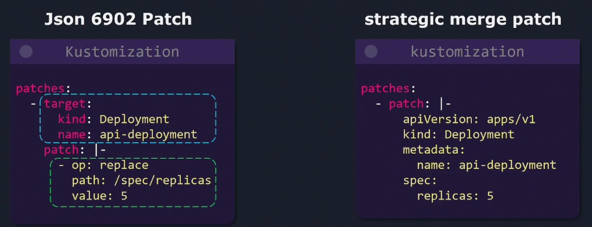

- 2가지 방식이 있음
  - Strategic Merge Patch
  - Json 6902 Patch

- Strategic Merge Patch

  ```yaml
  # kustomization.yaml
  patches:
    - patch: |-
        apiVersion: apps/v1
        kind: Deployment
        metadata:
          name: my-app        # 대상 리소스 지정
        spec:
          replicas: 5         # 변경할 내용만 작성
          template:
            spec:
              containers:
                - name: my-app
                  resources:
                    limits:
                      memory: "512Mi"
                      cpu: "500m"
  ```

- JSON 6902 Patch
  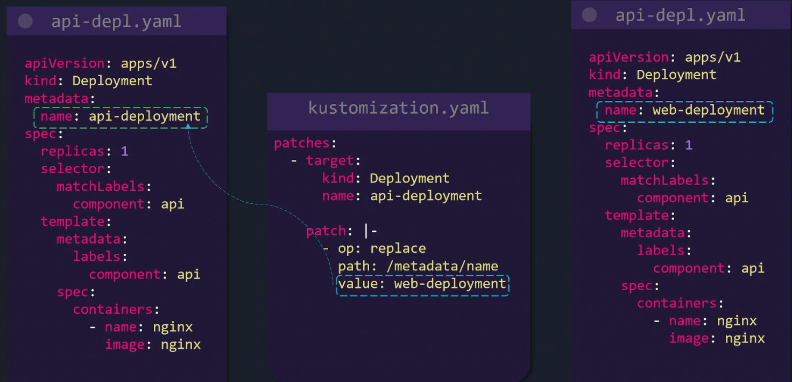

- Inline 방식과 Separate File 방식 지원
- Inline 방식

  ```yaml
  # kustomization.yaml
  patches:
    - target:
        kind: Deployment
        name: my-app
      patch: |-
        - op: replace
          path: /spec/replicas
          value: 5
  ---
  # OP 종류
  # replace - 값 변경
  - op: replace
    path: /spec/replicas
    value: 5

  # add - 값 추가
  - op: add
    path: /spec/template/spec/containers/0/env/-
    value:
      name: NEW_ENV
      value: "hello"

  # remove - 값 삭제
  - op: remove
    path: /spec/template/spec/containers/0/livenessProbe
  ```

- target 으로 여러 리소스에 동시 적용 가능

  ```yaml
  # kustomization.yaml
  patches:
    - target:
        kind: Deployment # kind로 필터
      patch: |-
        - op: add
          path: /spec/template/spec/containers/0/env/-
          value:
            name: ENV
            value: production

    - target:
        kind: Deployment
        labelSelector: "app=my-app" # 라벨로 필터
      patch: |-
        - op: replace
          path: /spec/replicas
          value: 3

    - target:
        group: apps
        version: v1
        kind: Deployment
        namespace: default
        name: my-app # 특정 리소스만
      path: specific-patch.yaml

  ---

  ## 4. 실무 패턴 — 환경별 overlays

  k8s/
  ├── base/
  │   ├── kustomization.yaml
  │   └── deployment.yaml      ← replicas: 1
  └── overlays/
      ├── dev/
      │   ├── kustomization.yaml
      │   └── patch-dev.yaml
      └── production/
          ├── kustomization.yaml
          └── patch-prod.yaml
  ```

- patch Separate File 방식
  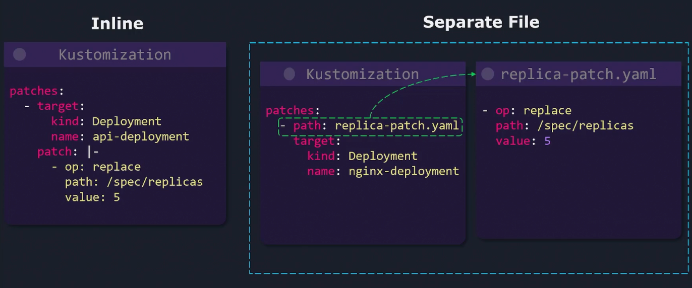
- merge Separate File 방식
  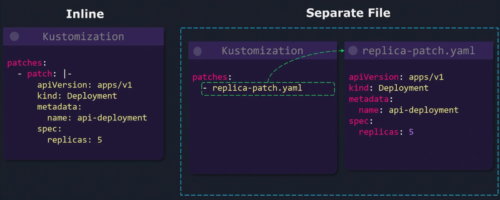

### Dictionary Json6902

- Replace Dictionary
  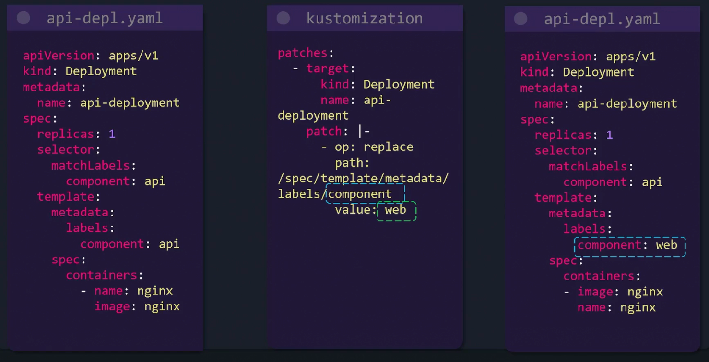

- Add Dictionary
  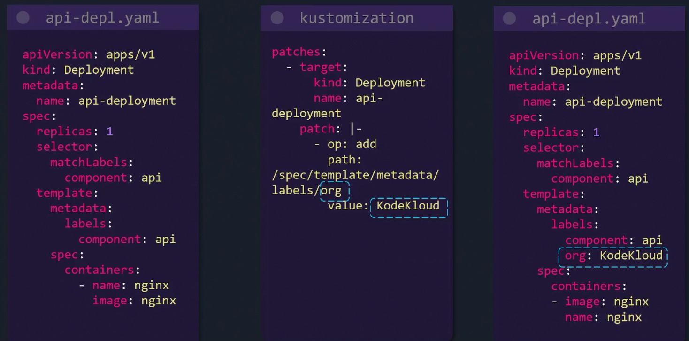

### Dictionary Strategic Merge Patch

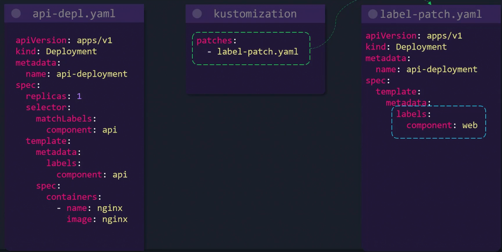

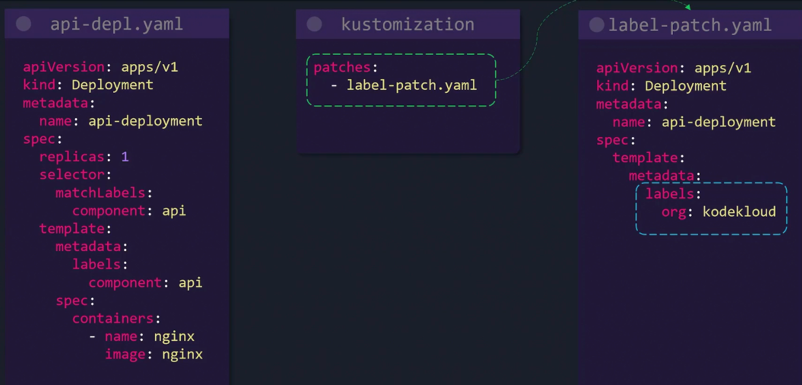

### List Json6902

- Replace List
  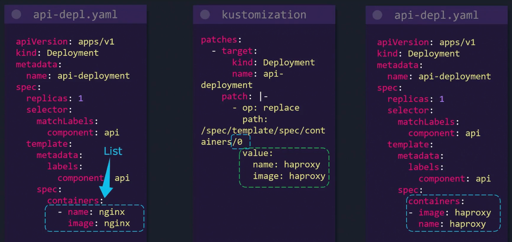
- Add List
  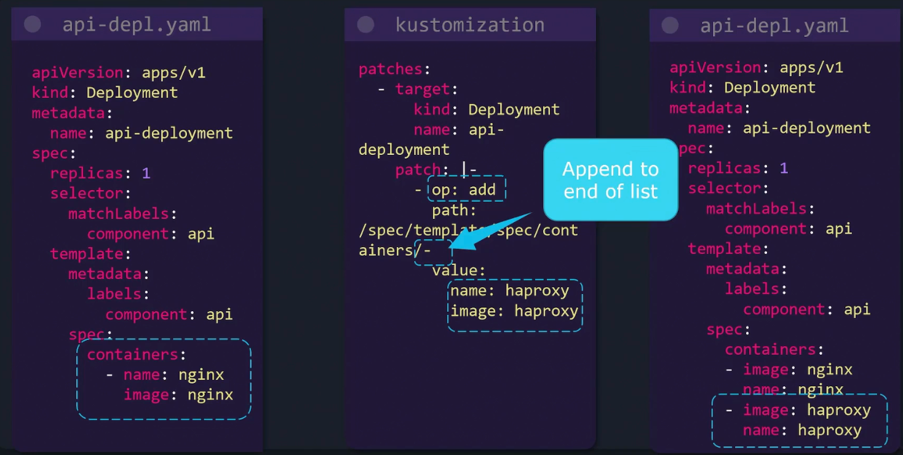

- Delete List
  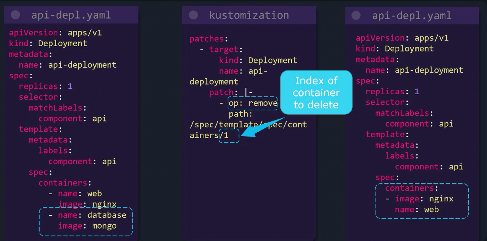

### List Strategic Merge Patch

- Replace List
  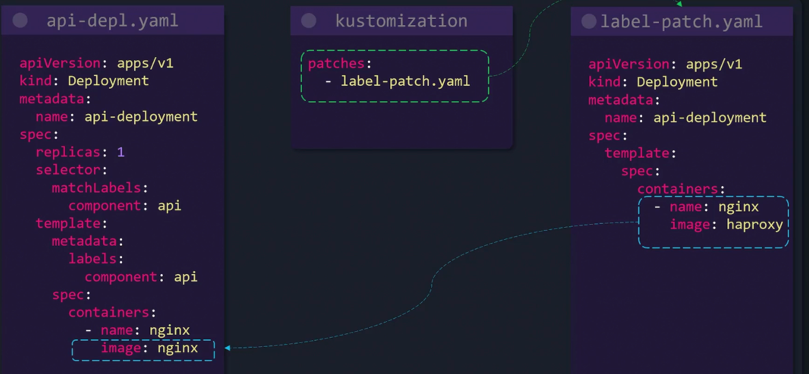

- Add List
  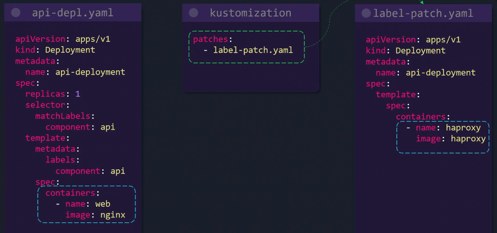

- Delete List
  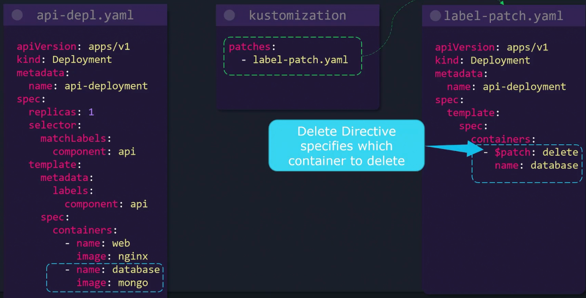

### Overlays

- base의 nginx-depl.yaml(replica: 1) 파일을 기반으로 dev는 replica를 2로 변경하고, prod는 replica를 3으로 변경
  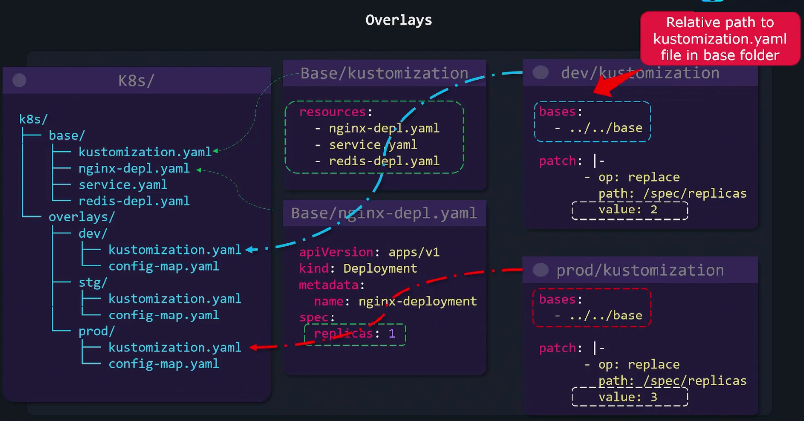

- base의 구조는 변경하지 않고 prod에서만 배포하는 방법
  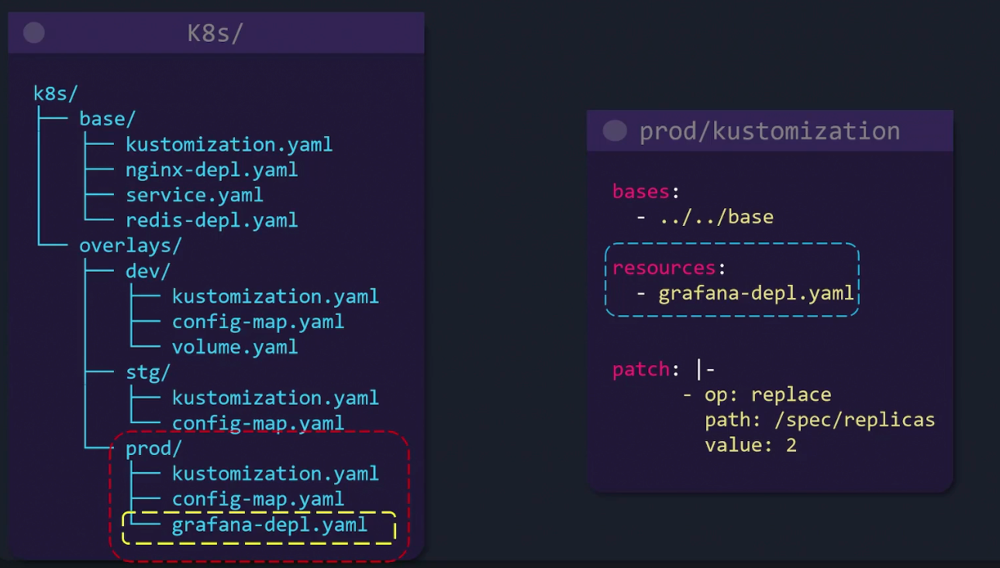

  ```yaml
  k8s/
  ├── base/                    # 공통 기본 리소스
  │   ├── kustomization.yaml
  │   ├── nginx-depl.yaml
  │   ├── service.yaml
  │   └── redis-depl.yaml
  └── overlays/
      ├── dev/                 # 개발 환경
      ├── stg/                 # 스테이징 환경
      └── prod/                # 운영 환경 ← 지금 설명 대상
          ├── kustomization.yaml
          ├── config-map.yaml
          └── grafana-depl.yaml   ← prod에만 추가된 리소스
  ---

  bases:
    - ../../base          # ① base 디렉토리 전체를 가져옴
                          #   (nginx-depl, service, redis-depl 포함)

  resources:
    - grafana-depl.yaml   # ② prod에만 추가로 배포할 리소스
                          #   (base에는 없고 prod에만 존재)

  patch: |-
    - op: replace
      path: /spec/replicas
      value: 2            # ③ base의 replicas를 2로 변경
  ```

### Components

- 여러 overlay에서 재사용 가능한 독립적인 기능 단위를 패키징하는 방법
- overlay와 달리 선택적으로 조합해서 사용
- 활용 예시

  ```text
  예시 시나리오:
  - dev, stg, prod 환경이 있을 때
  - "monitoring" 기능은 stg + prod에만 필요
  - "external-secret" 기능은 prod에만 필요
  - "debug" 기능은 dev에만 필요

  → 각 기능을 Component로 만들어 필요한 환경에만 조합
  ```

- 기본 구조

  ```bash
  k8s/
  ├── base/
  │   ├── kustomization.yaml
  │   ├── deployment.yaml
  │   └── service.yaml
  │
  ├── components/                  ← 재사용 가능한 기능 단위
  │   ├── monitoring/
  │   │   ├── kustomization.yaml   ← kind: Component
  │   │   ├── servicemonitor.yaml
  │   │   └── patch-metrics.yaml
  │   ├── external-secret/
  │   │   ├── kustomization.yaml
  │   │   └── secret.yaml
  │   └── debug/
  │       ├── kustomization.yaml
  │       └── patch-debug.yaml
  │
  └── overlays/
      ├── dev/
      │   └── kustomization.yaml   ← debug만 포함
      ├── stg/
      │   └── kustomization.yaml   ← monitoring만 포함
      └── prod/
          └── kustomization.yaml   ← monitoring + external-secret 포함
  ```

- Component 정의

  ```bash
  # components/monitoring/kustomization.yaml
  apiVersion: kustomize.config.k8s.io/v1alpha1
  kind: Component                  # ← Kustomization이 아닌 Component !

  resources:
    - servicemonitor.yaml          # 모니터링 관련 리소스 추가

  patches:
    - patch: |-
        apiVersion: apps/v1
        kind: Deployment
        metadata:
          name: my-app
        spec:
          template:
            metadata:
              annotations:
                prometheus.io/scrape: "true"  # 메트릭 수집 활성화
  ---
  # components/external-secret/kustomization.yaml
  apiVersion: kustomize.config.k8s.io/v1alpha1
  kind: Component

  resources:
    - secret.yaml

  patches:
    - patch: |-
        apiVersion: apps/v1
        kind: Deployment
        metadata:
          name: my-app
        spec:
          template:
            spec:
              containers:
                - name: my-app
                  envFrom:
                    - secretRef:
                        name: external-secret
  ---
  # components/debug/kustomization.yaml
  apiVersion: kustomize.config.k8s.io/v1alpha1
  kind: Component

  patches:
    - patch: |-
        apiVersion: apps/v1
        kind: Deployment
        metadata:
          name: my-app
        spec:
          template:
            spec:
              containers:
                - name: my-app
                  env:
                    - name: LOG_LEVEL
                      value: "debug"
  ```

- Overlay에서 조합

  ```yaml
  # overlays/dev/kustomization.yaml
  resources:
    - ../../base

  components:
    - ../../components/debug        # debug만 포함
  ---
  # overlays/stg/kustomization.yaml
  resources:
    - ../../base

  components:
    - ../../components/monitoring   # monitoring만 포함
  ---
  # overlays/prod/kustomization.yaml
  resources:
    - ../../base

  components:
    - ../../components/monitoring       # monitoring +
    - ../../components/external-secret  # external-secret 조합


  ---

  ### 최종 렌더링 결과

  dev   = base + debug
          └ LOG_LEVEL=debug 추가

  stg   = base + monitoring
          └ ServiceMonitor 추가
          └ prometheus 어노테이션 추가

  prod  = base + monitoring + external-secret
          └ ServiceMonitor 추가
          └ prometheus 어노테이션 추가
          └ Secret 추가
          └ envFrom secretRef 추가


  ---

  ### 핵심 정리

  kind: Component        → 반드시 명시 (Kustomization과 구분)
  components: []         → overlay의 kustomization.yaml에서 선택적으로 조합
  단독 빌드 불가         → 반드시 overlay에 포함되어야 함

  overlay  →  환경 전체를 정의  (dev / stg / prod)
  component →  기능 하나를 정의  (monitoring / secret / debug)
  ```
