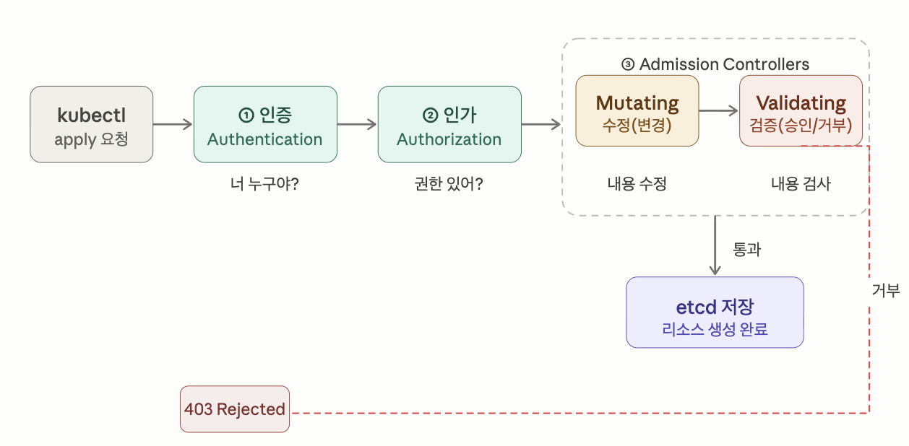

# Admission Controllers

## 동작 순서

- 사용자 요청 -> 인증(Authentication) -> 인가(Authorization) -> Admission Controllers -> etcd 저장
  

## 동작 방법

- Mutating(변경형)
  - 요청 내용에 부합하지 않으면 수정
- Validating(검증형)
  - 요청 내용을 수정하지 않고 통과/거부만 결정
- 실행 순서는 Mutating -> Validating 순서로 결과물 검증
- 예시
  - `NamespaceLifecycle`
    - 삭제 중인 네임스페이스에 리소스 생성 막음
  - `LimitRanger`
    - Pod에 리소스 limit이 없으면 기본값 주입(Mutating)
  - `ResourceQuota`
    - 네임스페이스 리소스 사용량 초과 시 거부(Validating)

## 설정 방법

- kube-apiserver 실행 시 플래그로 제어

```yaml
--enable-admission-plugins=NamespaceLifecycle,LimitRanger,ResourceQuota
--disable-admission-plugins=...
```

## Webhook 방식

- 기본 내장 컨트롤러 외에, 커스텀 로직을 붙일 수 있음
- 요청 -> API Server -> 외부 웹훅 서버 호출 -> 응답

# 연습문제

/etc/kubernetes/imgvalidation 경로에 있는 미완성 설정을 완성하세요.
이 디렉토리에는 다음 파일들이 있습니다

- admission-configuration.yaml — ImagePolicyWebhook 플러그인 설정을 참조하는 AdmissionConfiguration 리소스
- imagepolicy-conf.yaml — ImagePolicyWebhook 플러그인 설정 파일 (미완성)
- kubeconf.yaml — API Server가 웹훅 서버에 연결할 때 사용하는 kubeconfig 파일 (미완성)
- webhook.crt — 웹훅 서버의 TLS 인증서

아래 명령어로 파일을 확인하고, 다음 두 가지 문제를 고쳐야 합니다:

- imagepolicy-conf.yaml의 defaultAllow: true → 웹훅 백엔드에 연결 불가 시 이미지를 허용하는 상태 (fail-open). 이걸 거부(fail-close) 로 바꿔야 함
- kubeconf.yaml의 서버 주소가 https://placeholder.example.com 으로 되어 있음 → 실제 웹훅 URL로 바꿔야 함

## 해설

- ImagePolicyWebhook이란?
  - ValidatingWebhookConfiguration과 비슷하지만, 이미지 검사 전용으로 특화된 내장 Admission Controller

```text
Pod 생성 요청
     ↓
ImagePolicyWebhook (이미지 주소를 외부 웹훅 서버에 물어봄)
     ↓
웹훅 서버: "이 이미지 써도 돼?" → 허용/거부 응답
     ↓
etcd 저장 or 거부
```

- 파일 종류

```bash
/etc/kubernetes/imgvalidation ➜  ls
admission-configuration.yaml  kubeconf.yaml  webhook.key
imagepolicy-conf.yaml         webhook.crt
```

- `admission-configuration.yaml`
  ```bash
  cat admission-configuration.yaml
    apiVersion: apiserver.config.k8s.io/v1
    kind: AdmissionConfiguration
    plugins:
    - name: ImagePolicyWebhook # 사용할 플러그인
    path: /etc/kubernetes/imgvalidation/imagepolicy-conf.yaml # 세부 설정 파일
  ```
- `imagepolicy-conf.yaml`

```bash
cat imagepolicy-conf.yaml
  imagePolicy:
  kubeConfigFile: /etc/kubernetes/imgvalidation/kubeconf.yaml # 웹훅 서버 연결 정보
  allowTTL: 50 # 허용 결과를 50초간 캐시
  denyTTL: 50 # 거부 결과를 50초간 캐시
  retryBackoff: 500 # 실패 시 재시도 대기 시간 (ms)
  defaultAllow: false # 웹훅 연결 불가 시 → 허용 or 거부
```

    - `defaultAllow`의 의미
      - 웹훅 서버에 연결이 안 될 때 어떻게 할지 결정하는 옵션
        - defaultAllow: true  → 연결 불가 시 그냥 허용 (보안상 위험, fail-open)
        - defaultAllow: false → 연결 불가 시 무조건 거부 (보안상 안전, fail-close)

- `kubeconf.yaml`
  - API Server가 웹훅 서버에 접속할 때 사용하는 파일

```bash
apiVersion: v1
kind: Config
clusters:
- cluster:
    certificate-authority: /etc/kubernetes/imgvalidation/webhook.crt # 웹훅 서버 인증서
    server: https://placeholder.example.com # 웹훅 서버 실제 주소
  name: checker_webhook
contexts:
- context:
    cluster: checker_webhook
    user: api-server
  name: checker_validator
current-context: checker_validator
preferences: {}
users:
- name: api-server
  user:
    client-certificate: /etc/kubernetes/pki/front-proxy-client.crt
    client-key: /etc/kubernetes/pki/front-proxy-client.key
```

- `webhook.crt`, `webhook.key`
  - 웹훅 서버의 TLS 인증서

```text
kube-apiserver
    │
    │  --admission-control-config-file 플래그로 읽음
    ▼
admission-configuration.yaml      ← "ImagePolicyWebhook 플러그인 써라"
    │
    │  path 항목으로 참조
    ▼
imagepolicy-conf.yaml              ← "동작 방식 설정 (defaultAllow 등)"
    │
    │  kubeConfigFile 항목으로 참조
    ▼
kubeconf.yaml                      ← "웹훅 서버 주소 + 인증서 경로"
    │
    │  certificate-authority 항목으로 참조
    ▼
webhook.crt                        ← "웹훅 서버 TLS 인증서"
    │
    │  HTTPS 통신
    ▼
웹훅 서버                           ← "이미지 허용/거부 판단"
```

- 적용
  - `kube-apiserver`
  ```yaml
  $ cat kube-apiserver.yaml
  apiVersion: v1
  kind: Pod
  metadata:
  ...
  spec:
    name: kube-apiserver
    namespace: kube-system
  spec:
    containers:
    - command:
      - kube-apiserver
  ...
      - --enable-admission-plugins=NodeRestriction,ImagePolicyWebhook # ImagerPolicyWebhook 추가
      - --admission-control-config-file=/etc/kubernetes/imgvalidation/admission-configuration.yaml # 세부 설정 파일 경로 추가
  ...
      - --tls-private-key-file=/etc/kubernetes/pki/apiserver.key
      image: registry.k8s.io/kube-apiserver:v1.35.0
      imagePullPolicy: IfNotPresent
  ...
      name: kube-apiserver
  ...
  # 볼륨 마운트 추가
      volumeMounts:
      - mountPath: /etc/kubernetes/imgvalidation
        name: image
        readOnly: true
  ...
  # 볼륨 추가
    volumes:
    - hostPath:
        path: /etc/kubernetes/imgvalidation
        type: Directory
      name: image
  ...
  ```
- latest 태그를 갖는 파드 배포

  ```bash
  $ cat test-deploy.yaml
  apiVersion: v1
  kind: Pod
  metadata:
    name: test-deploy
  spec:
    containers:
    - name: nginx
      image: nginx:latest

  $ k apply -f test-deploy.yaml
  Error from server (Forbidden): error when creating "test-deploy.yaml": pods "test-deploy" is forbidden: image policy webhook backend denied one or more images: Images using latest tag are not allowed
  ```
