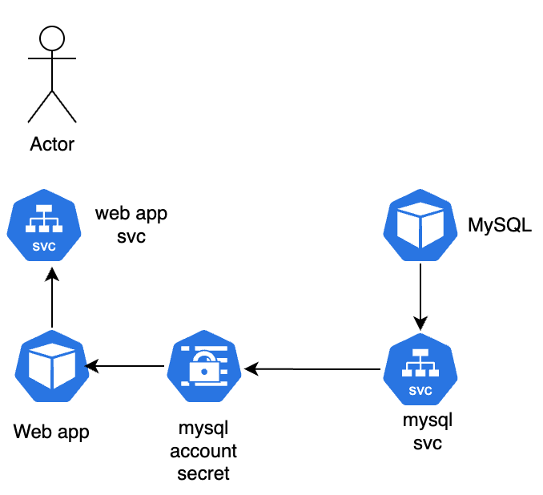

# 문제 풀이

## 기본 설정

```bash
export de='--force --grace-period=0'
export dr='-o yaml --dry-run=client'
```

## 01 expose

`default` 네임스페이스에 `httpd:alpine` 이미지를 사용하여 `httpd`라는 이름의 Pod를 생성하세요. 그런 다음, 동일한 이름(`httpd`)으로 ClusterIP 타입의 서비스를 생성하여 Pod의 80번 포트를 노출하세요.
가능한 적은 단계로 수행해보세요.

- `httpd` Pod가 올바른 이미지로 생성되었나요?
- `httpd` 서비스가 `ClusterIP` 타입인가요?
- `httpd` 서비스가 올바른 타겟 포트 80을 사용하나요?
- `httpd` 서비스가 `httpd` Pod를 노출하고 있나요?

  ```bash
  $ k run httpd --image httpd:alpine
  pod/httpd created

  $ k expose pods httpd --port 80
  service/httpd exposed

  # 확인
  $ k get pods,svc httpd -o wide
  NAME        READY   STATUS    RESTARTS   AGE     IP           NODE           NOMINATED NODE   READINESS GATES
  pod/httpd   1/1     Running   0          3m33s   10.22.0.17   controlplane   <none>           <none>

  NAME            TYPE        CLUSTER-IP     EXTERNAL-IP   PORT(S)   AGE     SELECTOR
  service/httpd   ClusterIP   10.43.226.36   <none>        80/TCP    2m26s   run=httpd

  $ k get ep httpd
  NAME    ENDPOINTS       AGE
  httpd   10.22.0.17:80   2m37s
  ```

## 02 explain

- explain 커맨드 사용

  ```bash
  $ k explain pods
  KIND:       Pod
  VERSION:    v1

  DESCRIPTION:
      Pod is a collection of containers that can run on a host. This resource is
      created by clients and scheduled onto hosts.

  FIELDS:
    apiVersion    <string>
      APIVersion defines the versioned schema of this representation of an object.
      Servers should convert recognized schemas to the latest internal value, and
      may reject unrecognized values. More info:
      https://git.k8s.io/community/contributors/devel/sig-architecture/api-conventions.md#resources

    kind  <string>
      Kind is a string value representing the REST resource this object
      represents. Servers may infer this from the endpoint the client submits
      requests to. Cannot be updated. In CamelCase. More info:
      https://git.k8s.io/community/contributors/devel/sig-architecture/api-conventions.md#types-kinds

    metadata      <ObjectMeta>
      Standard object's metadata. More info:
      https://git.k8s.io/community/contributors/devel/sig-architecture/api-conventions.md#metadata

    spec  <PodSpec>
      Specification of the desired behavior of the pod. More info:
      https://git.k8s.io/community/contributors/devel/sig-architecture/api-conventions.md#spec-and-status

    status        <PodStatus>
      Most recently observed status of the pod. This data may not be up to date.
      Populated by the system. Read-only. More info:
      https://git.k8s.io/community/contributors/devel/sig-architecture/api-conventions.md#spec-and-status
  ```

- Deployment replicas 필드 타입 확인 방법

  ```bash
  kubectl explain deployment.spec.replicas
  GROUP:      apps
  KIND:       Deployment
  VERSION:    v1

  FIELD: replicas <integer>


  DESCRIPTION:
      Number of desired pods. This is a pointer to distinguish between explicit
      zero and not specified. Defaults to 1.
  ```

- `--recursive` 옵션
  - 모든 하위 필드까지 트리 구조로 보여줌

  ```bash
  # 옵션 사용하지 않는 경우
  $ k explain deploy.spec | head -n 20
  GROUP:      apps
  KIND:       Deployment
  VERSION:    v1

  FIELD: spec <DeploymentSpec>


  DESCRIPTION:
      Specification of the desired behavior of the Deployment.
      DeploymentSpec is the specification of the desired behavior of the
      Deployment.

  FIELDS:
    minReadySeconds       <integer>
      Minimum number of seconds for which a newly created pod should be ready
      without any of its container crashing, for it to be considered available.
      Defaults to 0 (pod will be considered available as soon as it is ready)

    paused        <boolean>
      Indicates that the deployment is paused.

  # 옵션 사용
  k explain deploy.spec --recursive | head -n 20
  GROUP:      apps
  KIND:       Deployment
  VERSION:    v1

  FIELD: spec <DeploymentSpec>


  DESCRIPTION:
      Specification of the desired behavior of the Deployment.
      DeploymentSpec is the specification of the desired behavior of the
      Deployment.

  FIELDS:
    minReadySeconds       <integer>
    paused        <boolean>
    progressDeadlineSeconds       <integer>
    replicas      <integer>
    revisionHistoryLimit  <integer>
    selector      <LabelSelector> -required-
      matchExpressions    <[]LabelSelectorRequirement>
  ```

## FQDN

```bash
# 서비스명.네임스페이스.오브젝트.cluster.local
redis-db-service.dev.svc.cluster.local
```

## HPA(Horizontal Pod Autoscaling)

- CPU, Memory 사용량을 보고 POD 수를 자동으로 늘리거나 줄이는 기능

## command

- Ubuntu 이미지로 5000초 동안 sleep하는 컨테이너를 실행하는 파드를 생성하세요. `ubuntu-sleeper-2.yaml` 파일을 수정하세요.

  ```bash
  $ k run ubuntu-sleeper-2 --image ubuntu --command sleep 5000
  pod/ubuntu-sleeper-2 created
  ```

- 이 이미지로 컨테이너를 시작할 때 어떤 명령어가 실행될지 주의 깊게 살펴보고 확인하세요.

  ```bash
  $ cat Dockerfile
  FROM python:3.6-alpine

  RUN pip install flask

  COPY . /opt/

  EXPOSE 8080

  WORKDIR /opt

  ENTRYPOINT ["python", "app.py"]
  ```

  - `python app.py`

- 이 이미지로 컨테이너를 시작할 때 어떤 명령어가 실행될지 주의 깊게 살펴보고 확인하세요.

  ```bash
  $ cat webapp-color/Dockerfile2
  FROM python:3.6-alpine

  RUN pip install flask

  COPY . /opt/

  EXPOSE 8080

  WORKDIR /opt

  ENTRYPOINT ["python", "app.py"]

  CMD ["--color", "red"]
  ```

  - `python app.py --color red`

- `webapp-color-2` 디렉토리에는 `Dockerfile`과 쿠버네티스 파드 YAML 파일인 `webapp-color-pod.yaml`이 있습니다.
  `webapp-color-pod.yaml`에 정의된 파드가 시작될 때, 컨테이너 내부에서 실제로 어떤 명령어가 실행될까요?

  ```bash
  $ cat Dockerfile
  FROM python:3.6-alpine

  RUN pip install flask

  COPY . /opt/

  EXPOSE 8080

  WORKDIR /opt

  ENTRYPOINT ["python", "app.py"]

  CMD ["--color", "red"]

  $ cat webapp-color-pod.yaml
  apiVersion: v1
  kind: Pod
  metadata:
    name: webapp-green
    labels:
        name: webapp-green
  spec:
    containers:
    - name: simple-webapp
      image: kodekloud/webapp-color
      command: ["--color","green"]
  ```

  - `--color green`

- `webapp-color-3` 디렉토리에는 `Dockerfile`과 쿠버네티스 파드 YAML 파일인 `webapp-color-pod-2.yaml`이 있습니다.
  `webapp-color-pod-2.yaml`에 정의된 파드가 시작될 때, 컨테이너 내부에서 실제로 어떤 명령어가 실행될까요?

  ```bash
  $ cat Dockerfile
  FROM python:3.6-alpine

  RUN pip install flask

  COPY . /opt/

  EXPOSE 8080

  WORKDIR /opt

  ENTRYPOINT ["python", "app.py"]

  CMD ["--color", "red"]

  $ cat webapp-color-pod-2.yaml
  apiVersion: v1
  kind: Pod
  metadata:
    name: webapp-green
    labels:
        name: webapp-green
  spec:
    containers:
    - name: simple-webapp
      image: kodekloud/webapp-color
      command: ["python", "app.py"]
      args: ["--color", "pink"]
  ```

  - `python app.py --color pink`

- 초록색 배경의 웹 애플리케이션을 실행하는 쿠버네티스 파드를 생성하세요.
  - 파드 이름: webapp-green
  - 도커 이미지: kodekloud/webapp-color
  - 애플리케이션은 기본 파란색 대신 초록색 배경을 표시해야 합니다.
  - 커맨드(command)가 아닌 컨테이너 인수(args)로 --color=green 명령줄 인수를 전달하세요.
  ```bash
  # --help 명령으로 args 전달하는 방법 확인 가능함
  # kubectl run nginx --image=nginx -- <arg1> <arg2> ... <argN>
  $ k run webapp-green --image kodekloud/webapp-color -- --color=green
  ```

## Secrets

- 아래 주어진 데이터로 db-secret이라는 새로운 시크릿을 생성하세요.
  - DB_Host = sql01
  - DB_User = root
  - DB_Password = password123
    

```bash
k create secret generic db-secret --from-literal DB_Host=sql01 --from-literal DB_User=root --from-literal DB_Password=password123

# pod에 마운트 하는 두가지 방법
# 1. 전체 마운트
apiVersion: v1
kind: Pod
metadata:
  name: secret-test-pod
spec:
  containers:
    - name: test-container
      image: registry.k8s.io/busybox
      command: [ "/bin/sh", "-c", "env" ]
      ##### envFrom.secretRef #####
      envFrom:
      - secretRef:
          name: mysecret

# 2. key 값으로 마운트
apiVersion: v1
kind: Pod
metadata:
  name: secret-env-pod
spec:
  containers:
  - name: mycontainer
    image: redis
    ##### env.valueFrom.secretKeyRef ####
    env:
      - name: SECRET_USERNAME
        valueFrom:
          secretKeyRef:
            name: mysecret
            key: username
```

## Service Account

- default 네임스페이스에 있는 기존 ServiceAccount dashboard-sa를 수정하여 API 자격증명(credentials)의 자동 마운트를 비활성화하세요.
- 기존 web-dashboard Deployment를 수정하여 아래 경로에 ServiceAccount 토큰을 **주입(마운트)** 하세요:
  `/var/run/secrets/kubernetes.io/serviceaccount/token` token이라는 이름의 projected 볼륨을 사용하여 ServiceAccount 토큰을 주입하고, **읽기 전용(read-only)** 으로 마운트
- 체크리스트
  - dashboard-sa에 automountServiceAccountToken : false
  - Deployment 이름 : web-dashboard
  - token이라는 이름의 Projected 볼륨 생성
  - token 볼륨 마운트 존재 여부
  - 볼륨 마운트가 읽기 전용(read-only)
  - Deployment 정상 실행(Ready) 여부

```yaml
apiVersion: apps/v1
kind: Deployment
metadata:
  name: web-dashboard
  namespace: default
  labels:
    name: web-dashboard
spec:
  replicas: 1
  selector:
    matchLabels:
      name: web-dashboard
  template:
    metadata:
      labels:
        name: web-dashboard
    spec:
      containers:
        - name: web-dashboard
          image: gcr.io/kodekloud/customimage/my-kubernetes-dashboard
          ports:
            - containerPort: 8080
          env:
            - name: PYTHONUNBUFFERED
              value: "1"
          ## 볼륨 마운트 설정 ##
          ## mountPath에 token까지 입력해주면 오류 발생함
          volumeMounts:
            - mountPath: /var/run/secrets/kubernetes.io/serviceaccount
              name: token
              readOnly: true
      ## 볼륨 설정 ##
      volumes:
        - name: token
          projected:
            sources:
              - serviceAccountToken:
                  path: token
      serviceAccountName: dashboard-sa
      ## 비활성화 ##
      automountServiceAccountToken: false
```

- sa 수정

```bash
$ k get sa dashboard-sa -o yaml
apiVersion: v1
kind: ServiceAccount
metadata:
  name: dashboard-sa
  namespace: default
# 비활성화
automountServiceAccountToken: false
```

## network policy

**NetworkPolicy를 생성하여 `Internal` 애플리케이션에서 `payroll-service`와 `db-service`로만 `egress` 트래픽을 허용하세요.**
아래 스펙을 사용하세요. UI에서 규칙을 테스트하기 위해 해당 Pod로 들어오는 ingress 트래픽도 허용하는 것이 좋습니다.
또한, internal Pod에서 DNS 해석이 가능하도록 TCP 및 UDP의 DNS 포트(53번)에 대한 egress 트래픽도 허용해야 합니다.

- **Policy Name:** internal-policy
- **Policy Type:** Egress
- **Egress 허용 대상:** payroll
- **Payroll 포트:** 8080
- **Egress 허용 대상:** mysql

```yaml
apiVersion: networking.k8s.io/v1
kind: NetworkPolicy
metadata:
  name: internal-policy
  namespace: default
spec:
  podSelector:
    matchLabels:
      name: internal
  policyTypes:
    - Egress
    - Ingress
  ingress:
    - {}
  egress:
    - to:
        - podSelector:
            matchLabels:
              name: mysql
      ports:
        - protocol: TCP
          port: 3306

    - to:
        - podSelector:
            matchLabels:
              name: payroll
      ports:
        - protocol: TCP
          port: 8080

    - ports:
        - port: 53
          protocol: UDP
        - port: 53
          protocol: TCP
```

## Ingress

- default backend 설정 확인

### Ingress 리소스 확인

```bash
kubectl describe ingress --namespace app-space

# - 각 경로별 백엔드 서비스 (/wear -> wear-service, /watch -> video-service)
# - Default backend: <default>  <- Ingress 리소스에는 설정 없음을 의미
```

### 2단계: Ingress Controller 확인

```bash
kubectl get deploy ingress-nginx-controller -n ingress-nginx -o yaml

# 결과에서 확인할 항목 (args 섹션):
# - --default-backend-service=app-space/default-backend-service
#   <- 클러스터 전체에 적용되는 전역 fallback 서비스
```

### Default backend가 설정되는 두 가지 위치

- Ingress 리소스 내부 (해당 Ingress에만 적용)

```yaml
apiVersion: networking.k8s.io/v1
kind: Ingress
spec:
  defaultBackend:
    service:
      name: default-backend-service
      port:
        number: 80
```

- Ingress Controller args (클러스터 전체에 적용)

```yaml

...
args:
  - --default-backend-service=app-space/default-backend-service
```

- 요청 경로별 라우팅 결과

```bash
# /wear   -> wear-service:8080
# /watch  -> video-service:8080
# 그 외   -> default-backend-service  (Controller 레벨에서 처리)
```

## Docker Images

- 이 Dockerfile로 빌드된 이미지를 사용하여 컨테이너를 생성할 때, 컨테이너 내부에서 애플리케이션을 실행하는 데 사용되는 명령어는 무엇입니까?
- 핵심 포인트
  - 여기서 "RUN" 은 Dockerfile의 RUN 명령어를 묻는 것이 아니라, "컨테이너가 시작될 때 앱을 실행하는 명령어가 무엇이냐?" 를 묻는 것입니다!
  - 즉, Entrypoint에 정의된 값이 됨
  - RUN : 이미지 빌드 시 실행 (레이어 생성), 단순히 flask를 설치하는 커맨드임
  - ENTRYPOINT : 컨테이너 시작 시 실행 (앱 구동)

```dockerfile
FROM python:3.6
RUN pip install flask
COPY . /opt/
EXPOSE 8080
WORKDIR /opt
ENT
RYPOINT ["python", "[app.py](http://app.py)"]
```

- python3:6 이미지의 OS는 무엇인가요?

```bash
#docker run [Docker 옵션] [이미지명] [앱 인자]
#           ←────────────→ ←───────→ ←────────→
#                 ↑            ↑          ↑
#            이미지 앞!      필수!     선택사항

docker run python:3.6 cat /etc/*release*
```

- webapp-color 이미지의 인스턴스를 실행하고, 컨테이너의 8080 포트를 호스트의 8282 포트로 게시(연결)하세요

```bash
#docker run -p [호스트포트]:[컨테이너포트] 이미지명
#                    ↑              ↑
#              내 컴퓨터 포트    컨테이너 내부 포트
docker run -p 8383:8080 webapp-color:lite
```

## Kubeconfig

- 매번 kubectl 명령어에 kubeconfig 파일 옵션을 지정하고 싶지 않습니다.
  - my-kube-config 파일을 기본 kubeconfig 파일로 설정
  - 기존 ~/.kube/config를 덮어쓰지 않으면서 모든 세션에서 영구적으로 유지
  - 재부팅 및 새로운 쉘 세션에서도 설정이 유지
  - 참고: 현재 세션에 적용하려면 설정 파일을 source 하는 것을 잊지 마세요.

```bash
vi .bashrc
export KUBECONFIG=/root/my-kube-config

source ~/.bashrc
```

- 현재 컨텍스트가 research로 설정된 상태에서 클러스터에 접근하려고 하지만 접근이 되지 않습니다. 문제를 파악하고 수정하세요.

```bash
# k get nodes
error: unable to read client-cert /etc/kubernetes/pki/users/dev-user/developer-user.crt for dev-user due to open /etc/kubernetes/pki/users/dev-user/developer-user.crt: no such file or directory

# ls /etc/kubernetes/pki/users/dev-user/dev-user.
dev-user.crt  dev-user.csr  dev-user.key
```

- 수정

```bash
# k config view | grep -A3 dev-user
--
- name: dev-user
  user:
    client-certificate: /etc/kubernetes/pki/users/dev-user/developer-user.crt
    client-key: /etc/kubernetes/pki/users/dev-user/dev-user.key

# k config set-credentials dev-user \
# --client-certificate=/etc/kubernetes/pki/users/dev-user/dev-user.crt \
# --client-key=/etc/kubernetes/pki/users/dev-user/dev-user.key
User "dev-user" set.

# k config view | grep -A3 dev-user
--
- name: dev-user
  user:
    client-certificate: /etc/kubernetes/pki/users/dev-user/dev-user.crt
    client-key: /etc/kubernetes/pki/users/dev-user/dev-user.key
```

- `/root/my-kube-config` 의 클러스터 정보 확인

```bash
k config get-clusters --kubeconfig /root/my-kube-config
NAME
production
development
kubernetes-on-aws
test-cluster-1

k config get-contexts --kubeconfig /root/my-kube-config
CURRENT   NAME                         CLUSTER             AUTHINFO    NAMESPACE
          aws-user@kubernetes-on-aws   kubernetes-on-aws   aws-user
          research                     test-cluster-1      dev-user
*         test-user@development        development         test-user
          test-user@production         production          test-user

# aws-user 계정의 client certificate 확인
k config view --kubeconfig /root/my-kube-config | grep -A3 ": aws-user"
--
- name: aws-user
  user:
    client-certificate: /etc/kubernetes/pki/users/aws-user/aws-user.crt
    client-key: /etc/kubernetes/pki/users/aws-user/aws-user.key

# 현재 컨텍스트 확인
k config current-context --kubeconfig /root/my-kube-config
test-user@development
```

## RBAC

- dev-user 사용자가 생성되었습니다. 사용자의 세부 정보가 kubeconfig 파일에 추가되었습니다. 사용자에게 부여된 권한을 확인하세요. 해당 사용자가 default 네임스페이스에서 Pod 목록을 조회할 수 있는지 확인하세요.

```bash
k get pods --as dev-user
Error from server (Forbidden): pods is forbidden: User "dev-user" cannot list resource "pods" in API group "" in the namespace "default"

k auth can-i list pods --as dev-user
no
```

- dev-user가 default 네임스페이스에서 Pod를 생성, 조회, 삭제할 수 있도록 필요한 Role과 RoleBinding을 생성하세요
  - Role 이름: developer
  - Role 리소스: pods
  - Role 액션: list (조회)
  - Role 액션: create (생성)
  - Role 액션: delete (삭제)
  - RoleBinding 이름: dev-user-binding
  - RoleBinding: dev-user에게 바인딩"

```bash
# role 생성
$ k create role developer --verb=list,create,delete --resource=pods
role.rbac.authorization.k8s.io/developer created
# rolebinding 생성
$ k create rolebinding dev-user-binding --role developer --user dev-user
rolebinding.rbac.authorization.k8s.io/dev-user-binding created

# 조회
k auth can-i create pods --as dev-user
yes
# 생성
k auth can-i create pods --as dev-user
yes

k get pods --as dev-user
NAME                   READY   STATUS    RESTARTS   AGE
red-7cd8bb8d7c-887tx   1/1     Running   0          32m
red-7cd8bb8d7c-ttwns   1/1     Running   0          32m
```

### list vs get

```bash
# list - 전체 목록
kubectl get pods
NAME          READY   STATUS
pod-1         1/1     Running
pod-2         1/1     Running
pod-3         1/1     Running

# get - 특정 하나
kubectl get pod pod-1
NAME    READY   STATUS
pod-1   1/1     Running
```

- dev-user에게 blue 네임스페이스에서 deployment를 생성할 수 있는 권한을 부여하기 위해 기존 developer Role에 새로운 규칙을 추가하세요.
- API 그룹 "apps"를 추가하는 것을 잊지 마세요.

```bash
apiVersion: rbac.authorization.k8s.io/v1
kind: Role
metadata:
  name: developer
  namespace: blue
rules:
- apiGroups:
  - apps
  resourceNames:
  - dark-blue-app
  resources:
  - pods
  verbs:
  - get
  - watch
  - create
  - delete

# deployment 정책 추가
- apiGroups:
  - apps
  resources:
  - deployments
  verbs:
  - create

$ k describe role -n blue developer
Name:         developer
Labels:       <none>
Annotations:  <none>
PolicyRule:
  Resources         Non-Resource URLs  Resource Names   Verbs
  ---------         -----------------  --------------   -----
  deployments.apps  []                 []               [create]
  pods              []                 [dark-blue-app]  [get watch create delete]
```

## Cluster Role
