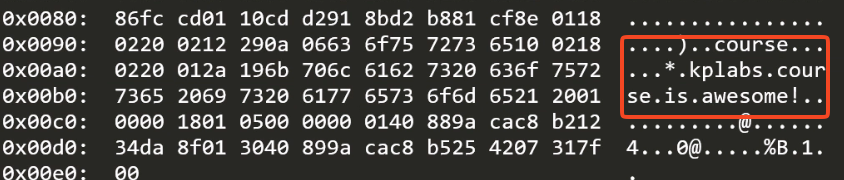
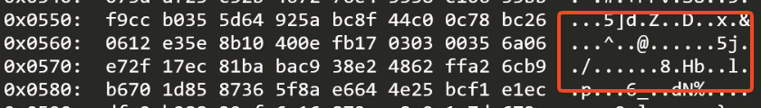
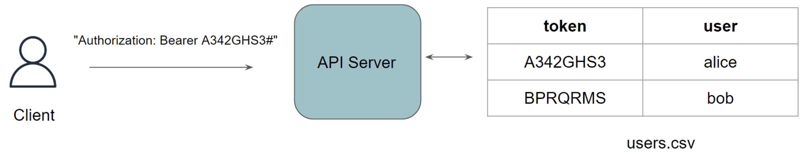

# Cluster Setup

## CIS Benchmarks(Center for Ineternet Security)

- 다양한 시스템, 소프트웨어(운영체제, 클라우드, 컨테이너, 쿠버네티스 등)에 대해 보안 모범 사례(Best Practice)를 정리해놓은 설정 가이드라인
- 비영리 단체인 CIS에서 보안 전문가들이 `이렇게 설정해야 안전하다`는 구체적인 기준(체크리스트 형태)을 제공

### kube-bench와의 관계

- CKS에서 실제로 다루는 도구는 `kube-bench`임
  - CIS Kubernetes Benchmark를 자동으로 검사해주는 오픈소스 도구 (Aqua Security 제작)
  - 클러스터가 CIS 벤치마크 기준을 얼마나 준수하는지 스캔하고 리포트 생성
    - 실행 결과가 `[PASS]`, `[FAIL]`, `[WARN]`, `[INFO]`로 표시됨
- 사용 방법

  ```bash
  # kube-bench 실행 (마스터 노드용)
  kube-bench run --targets master

  # 특정 체크 항목만 실행
  kube-bench run --targets master --check 1.2.15

  # 결과에서 FAIL 항목만 필터링
  kube-bench run --targets master | grep FAIL
  ```

## etcd security guidelines

- 기본적으로 `etcd` 내부의 데이터는 **평문(base64)으로 저장**됨
- etcd는 kubernetes 클러스터의 모든 상태 정보(Secrets 포함)를 저장하는 저장소로 etcd가 뚫리면 클러스터 전체가 뚫리는 것과 같음

### 1. 통신 암호화(TLS)

- 간단한 데모 테스트
- tls 비활성
  - etcd가 실행 중인 서버에서 3개의 터미널 탭 실행 - 1번째 터미널 : `etcdctl get course hello` 커맨드로 데이터를 넣기 위함 - 2번째 터미널 : `ss -nltp` 로 etcd가 실행 중인지 확인하기 위함 - 3번째 터미널 : `tcpdump -i lo -X port 2379`로 평문의 데이터가 오고 가는지 확인하기 위함
    
- tls 통신 활성
  ```bash
  etcd --listen-client-utls https://127.0.0.1:2379 --advertise-client-urls https://127.0.0.1:2379 --cert-file=etcd.crt --key-file=etcd.key
  ```
- 위에서 진행했던 데모 테스트 다시 실행

```bash
# etcdctl로 데이터 입력
etcdctl --endpoints=https://127.0.0.1:2379 --cacert=ca.crt put course "tls enabled!"

# etcdctl로 입력한 데이터 가져오기
etcdctl --endpoints=https://127.0.0.1:2379 --cacert=ca.crt get course
```

- 암호화 되어 출력되므로 알 수 없음
  

### 2. Authentication(인증)

- **클라이언트 인증서 기반 인증(mTLS)**
  - etcd는 기본적으로 상호 TLS(mTLS) 방식 사용
  - 서버뿐 아니라 클라이언트도 인증서를 제시해야 접속 허용

  ```text
  kube-apiserver  ──[클라이언트 인증서 제시]──▶  etcd 서버
                ◀──[서버 인증서 제시]──────────
                   양쪽 다 CA로 검증 → 상호 신뢰 확립
  ```

  ```bash
  --client-cert-auth=true              # 클라이언트 인증서 필수화
  --trusted-ca-file=/etc/kubernetes/pki/etcd/ca.crt   # 신뢰할 CA
  --cert-file=/etc/kubernetes/pki/etcd/server.crt
  --key-file=/etc/kubernetes/pki/etcd/server.key
  ```

- etcd 자체 사용자/역할 기반 인증(RBAC)
  - username/password 기반 인증(Root User Authentocation)

  ```bash
  # 1. root 사용자 생성
  etcdctl user add root

  # 2. 인증 활성화 (활성화 전까지는 인증 없이도 접근 가능!)
  etcdctl auth enable

  # 3. 이후부터 --user 옵션 없이 접근 시 거부됨
  etcdctl put key1 "value1"
  # Error: etcdserver: user name is empty

  # 4. --user로 인증하면 정상 동작
  etcdctl --user=root:password put key1 "value1"
  etcdctl --user=root:password put key2 "value2"
  ```

| 개념                              | 설명                                                            |
| --------------------------------- | --------------------------------------------------------------- |
| 인증 방식                         | mTLS (상호 인증서 검증) — CKS 핵심                              |
| 서버가 클라이언트 검증            | --client-cert-auth=true                                         |
| 클라이언트가 서버 검증            | --trusted-ca-file                                               |
| Kubernetes 컴포넌트 중 누가 접속? | kube-apiserver만 직접 접속 (다른 컴포넌트는 apiserver를 거침)   |
| 흔한 시험 함정                    | client-cert-auth=false로 되어 있어 인증서 없이 접근 가능한 상태 |

## Kubernetes 클러스터의 Certificate Authority(CA)

- 쿠버네티스 클러스터 여러 컴포넌트 간 통신을 보호하기 위해 하나가 아닌 여러 개의 CA를 사용
- 3개의 독립된 CA가 있음으로, 하나의 etcd가 뚫려도 다른 컴포넌트 인증서까지 위조하긴 어려움
  - Kubernetes CA(루트)
    - apiserver, kubelet, 사용자 인증서 서명 등
    - `/etc/kubernetes/pki/ca.crt (+ca.key)`
  - etcd CA
    - etcd 클라이언트/피어 인증서 서명
    - `/etc/kubernetes/pki/etcd/ca.crt`
  - front-proxy CA
    - API 확장(Aggregation Layer)인증서 서명
    - `/etc/kubernetes/pki/front-proxy-ca.crt`
  ```bash
  /etc/kubernetes/pki/
  ├── ca.crt / ca.key                          ← 루트 CA
  ├── apiserver.crt                            ← API 서버 자체 인증서
  ├── apiserver-kubelet-client.crt             ← apiserver → kubelet 인증
  ├── front-proxy-ca.crt                       ← 별도 CA (확장 API용)
  ├── front-proxy-client.crt
  └── etcd/
      ├── ca.crt / ca.key                      ← etcd 전용 CA
      ├── server.crt                           ← etcd 서버 인증서
      ├── peer.crt                             ← etcd 피어 인증서
      └── healthcheck-client.crt
  ```
- 인증서 확인 명령어

  ```bash
  # 인증서 만료일 확인
  kubeadm certs check-expiration

  # 특정 인증서 상세 정보
  openssl x509 -in /etc/kubernetes/pki/apiserver.crt -noout -text

  # 발급자(Issuer)와 대상(Subject) 확인
  openssl x509 -in /etc/kubernetes/pki/apiserver.crt -noout -issuer -subject
  ```

- 인증서 갱신
  - kubeadm 인증서는 기본적으로 1년이 유효기간임
  - CA 인증서 자체(ca.crt/ca.key)는 `kubeadm certs renew`로 갱신되지 않음
    - CA는 보통 10년 유효기간이고, CA를 교체하려면 클러스터 전체 인증서를 재발급해야됨

  ```bash
  # 전체 인증서 갱신
  kubeadm certs renew all

  # 특정 인증서만 갱신
  kubeadm certs renew apiserver

  # 갱신 후 static pod 재시작 필요 (kubelet이 자동 감지하지만 확인 권장)
  crictl ps | grep kube-apiserver
  ```

- 사용자 인증서 발급(CertificateSigningRequest)
  - CA를 이용해 새 사용자용 클라이언트 인증서를 발급 가능

  ```bash
  # 1. 개인키 + CSR 생성
  openssl genrsa -out user.key 2048
  openssl req -new -key user.key -out user.csr -subj "/CN=newuser/O=dev-team"

  # 2. Kubernetes CSR 오브젝트로 제출
  cat <<EOF | kubectl apply -f -
  apiVersion: certificates.k8s.io/v1
  kind: CertificateSigningRequest
  metadata:
    name: newuser-csr
  spec:
    request: $(cat user.csr | base64 | tr -d '\n')
    signerName: kubernetes.io/kube-apiserver-client
    usages:
    - client auth
  EOF

  # 3. 승인
  kubectl certificate approve newuser-csr

  # 4. 서명된 인증서 추출
  kubectl get csr newuser-csr -o jsonpath='{.status.certificate}' | base64 -d > user.crt
  ```

## etcd를 systemd로 통합하는 방법

- `kubeadm` 환경에서는 `etcd`가 static pod로 실행되지만, etcd를 바이너리로 직접 설치해서 운영할 때는 systemd 서비스로 관리하는게 일반적임
- etcd 디렉토리 생성
  ```bash
  mkdir /var/lib/etcd
  chmod 700 /var/lib/etcd
  ```
- systemd 파일 작성

  ```bash
  cat <<EOF | sudo tee /etc/systemd/system/etcd.service
  [Unit]
  Description=etcd
  Documentation=https://github.com/coreos

  [Service]
  ExecStart=/usr/local/bin/etcd \\
    --cert-file=/root/certificates/etcd.crt \\
    --key-file=/root/certificates/etcd.key \\
    --trusted-ca-file=/root/certificates/ca.crt \\
    --client-cert-auth \\
    --listen-client-urls https://127.0.0.1:2379 \\
    --advertise-client-urls https://127.0.0.1:2379 \\
    --data-dir=/var/lib/etcd
  Restart=on-failure
  RestartSec=5

  [Install]
  WantedBy=multi-user.target
  EOF
  ```

- etcd 시작, 상태 및 로그 확인

  ```bash
  systemctl start etcd

  systemctl enable etcd

  # 상태 확인
  systemctl status etcd

  # etcd 로그 확인
  journalctl -u etcd
  ```

## K8S Access Control(접근 제어)

- Kubernetes API에 대한 모든 요청은 **3단계 파이프라인**을 순서대로 거침

  ```scss
  요청 → [1. Authentication] → [2. Authorization] → [3. Admission Control] → etcd 저장
        (누구세요?)              (권한 있어요?)         (규칙에 맞나요?)
  ```

  - 위의 세 단계 중 하나라도 거부하면 요청 전체가 즉시 거부됨

- 1단계 - Authentication(인증)
  - 요청자의 신원을 확인하는 단계
  - Kubernetes는 여러 인증 방식을 동시에 지원하고, 하나라도 통과하면 인증 성공
  - 모드
    - `클라이언트 인증서(X.509 Client Certificate)`
      - test.crt 같은 방식(CN=사용자명, O=그룹명)
    - `정적 토큰 파일(Static Token File)`
      - 파일에 토큰-사용자 매핑(레거시, 비권장)
        
    - `ServiceAccount 토큰`
      - Pod 내부 프로세스가 사용하는 JWT 토큰
    - `Webhook 인증`
      - 외부 시스템에 인증 위임
- 2단계 - Auzthorization
  - 인증된 사용자가 요청한 동작을 수행할 권한이 있는지 확인
    - 모드
      - `RBAC`
        - 사실상 표준(Role/ClusterRole + RoleBinding/ClusterRoleBinding)
        ```bash
        # 특정 사용자가 특정 동작을 할 수 있는지 확인
        kubectl auth can-i create pods --as=zealvora -n dev
        ```
      - `Node Authorizer`
        - kubelet 전용 특수 인가(자기 노드 관련 리소스만 접근 허용)
      - `Webhook 인가`
        - 외부 시스템에 인가 위임(OPA/Gatekeeper 등과 연동 가능)
- 3단계 - Admission Control(규칙에 맞는지 확인)
  - 인증과 인가를 통과해도 요청 내용 자체가 클러스터 정책에 맞는지 검사/수정하는 마지막 관문
  - `Mutating Admission Plugins` 먼저 실행 후 `Validating Admission Plugins` 나중 실행
  - 모드
    - `Mutating Admission(내용 수정)`
      - 요청을 가로채서 값을 변경
      - 예
        - `AlwaysPullImages`는 `imagePullPolicy`를 강제로 **Always**로 변경
        - 기본 ServiceAccount 토큰 자동 마운트
    - `Validating Admission(검증만, 거부 가능)`
      - 요청이 정책에 맞는지 검사만 하고 맞지 않으면 거부
      - 예
        - `Pod Security Admission` (Privileged 컨테이너 금지 등)
        - `OPA/Gatekeeper, Kyverno` 커스텀 정책 엔진
- 전체적인 흐름 파악

  ```bash
  $ kubectl run mypod --image nginx --privileged -n dev
    1. Authentication
       → kubeconfig의 인증서 확인 → "test"로 인증됨

    2. Authorization
       → test가 dev 네임스페이스에서 pod 생성 권한 있는지 RBAC 확인
       → RoleBinding에 create 권한 있음

    3. Admission Control
       → Pod Security Admission이 --privileged 옵션 감지
       → "restricted" 정책 위반 → 거부
       → 최종 결과: Pod 생성 실패
  ```

## Encryption Provider

- etcd 보안에서 잠깐 언급됐던 **etcd에 저장되는 데이터 암호화**를 구현하는 매커니즘
- etcd에 저장되는 Secret은 base64 인코딩만 되어있을 뿐 암호화가 되어 있지 않음
  - base64는 암호화가 아닌 누구나 디코딩이 가능한 인코딩 값임
- apiserver 가 etcd에 쓰기 전 실제로 암호화하도록 설정하는 것을 *Encryption Provider*라고 함
- 설정 파일 구조
  ```yaml
  # /etc/kubernetes/enc/enc.yaml
  apiVersion: apiserver.config.k8s.io/v1
  kind: EncryptionConfiguration
  resources:
    - resources:
        - secrets # 암호화할 리소스 지정 (configmaps 등도 가능)
      providers:
        - aescbc: # 1순위 provider - 실제 암호화 수행
            keys:
              - name: key1
                secret: <base64-encoded-32byte-key>
        - identity: {} # 2순위 provider - 암호화 안 함(평문)
  ```
- Provider 종류
  | Provider | 설명 | 실제 암호화 여부 |
  | --------- | ------------------------------------------------------ | ---------------- |
  | identity | 암호화 안 함(기본값) | X |
  | aescbc | AES-CBC 방식, 가장 널리 쓰임 | O |
  | secretbox | XSalsa20-Poly1305 방식 | O |
  | kms | 외부 키 관리 시스템(AWS KMS, HashiCoprt Vault 등) 연동 | O |
- apiserver에 적용
  - 옵션이 없으면 Encryption Provider 설정 자체가 무시됨(identity만 적용)

  ```yaml
  # /etc/kubernetes/manifests/kube-apiserver.yaml
  - --encryption-provider-config=/etc/kubernetes/enc/enc.yaml
  ```

  - 적용 후 기존 데이터 재작성 필요
    - 설정만 하면 새로 생성되는 Secret부터 암호화되므로, 이미 etcd에 있던 secret은 여전히 평문으로 보관

  ```bash
  # 모든 네임스페이스의 기존 Secret을 강제로 다시 씀 (재작성 시 암호화 적용됨)
  kubectl get secrets --all-namespaces -o json | kubectl replace -f -
  ```

- 암호화 됐는지 검증

  ```bash
  # etcd에 직접 쿼리해서 raw 데이터 확인
  ETCDCTL_API=3 etcdctl get /registry/secrets/default/mysecret \
    --cacert=/etc/kubernetes/pki/etcd/ca.crt \
    --cert=/etc/kubernetes/pki/etcd/server.crt \
    --key=/etc/kubernetes/pki/etcd/server.key

  # 결과가 이렇게 나오면 암호화 성공
  k8s:enc:aescbc:v1:key1:암호화된바이너리...

  # 이렇게 평문(예: password123)이 그대로 보이면 암호화 안 된 것
  ```

## 감사 로깅(Implementing Auditing)

- Kubernetes Audit Logging(감사 로깅)은 클러스터에서 누가, 언제, 무엇을, 어떤 결과로 요청했는지를 기록하는 기능임
- 보안 사고 발생 시 누가 이 Secret을 조회했는지?와 같은 질문에 답을 할 수 있게 됨

### Test

- 감사로깅을 활성화 하고, 특정 사용자의 API 요청이 실제로 로그에 기록되는지 검증
- Audit Policy 파일 설정

  ```yaml
  apiVersion: audit.k8s.io/v1
  kind: Policy
  rules:
    - level: Metadata
  ```

  - **무엇을 어느 수준으로 기록할지**를 정의하는 정책 파일
  - rules가 비어있지 않고 `level: Metadata` 하나만 있다는 건, 모든 요청에 대해 Metadata 수준으로 기록하겠다는 의미
  - Audit Level 종류
    | Level | 기록내용 |
    | --------------- | -------------------------------------------------------------------------------- |
    | None | 기록하지 않음 |
    | Metadata | 요청자, 타임스탬프, 리소스, 동작(verb) 등 메타데이터만 기록(요청/응답 본문 제외) |
    | Request | Metadata + 요청 본문까지 기록 |
    | RequestResponse | Metadata + 요청 본문 + 응답 본문까지 전부 기록(가장 상세, 용량 큼) |

- apiserver에 Audit 옵션 적용

  ```bash
  --audit-policy-file=/root/certificates/logging.yaml   # 어떤 정책으로 기록할지
  --audit-log-path=/var/log/api-audit.log                # 로그 저장 경로
  --audit-log-maxage=30       # 로그 파일 보관 기간(일)
  --audit-log-maxbackup=10    # 보관할 이전 로그 파일 개수
  --audit-log-maxsize=100     # 로그 파일 최대 크기(MB), 넘으면 로테이션
  ```

  | 플래그                        | 역할                                     | 필수 여부                                       |
  | ----------------------------- | ---------------------------------------- | ----------------------------------------------- |
  | `--audit-policy-file`         | 감사 정책 파일 경로 지정                 | 필수(없으면 Audit 기능 자체가 비활성)           |
  | `--audit-log-path`            | 로그를 파일로 저장할 경로                | 필수(없으면 stdout으로만 출력)                  |
  | `--audit-log-maxage`          | 로그 파일 보관 일수                      | 선택 (기본값 없음, 오래된 로그 자동 삭제 안 함) |
  | `--audit-log-maxbackup`       | 보관할 백업 로그 파일 개수               | 선택                                            |
  | `--audit-log-maxsize`         | 로그 파일 최대 크기(MB), 넘으면 로테이션 | 선택                                            |
  | `--audit-webhook-config-file` | 파일 대신 외부 웹훅으로 로그 전송        | 선택(실무에서는 SIEM 연동 시 사용)              |

  > kubeadm 환경(static pod)이라면 /etc/kubernetes/manifests/kube-apiserver.yaml을 수정하고, 로그 파일과 정책 파일을 컨테이너에 hostPath 볼륨으로 마운트해줘야 됨

  > 위의 방식은 systemd 방식으로 볼륨을 따로 마운트 하지 않음

- 특정 사용자로 요청 발생
  ```bash
  kubectl get secret --server=https://127.0.0.1:6443 \
  --client-certificate /root/certificates/bob.crt \
  --certificate-authority /root/certificates/ca.crt \
  --client-key /root/certificates/bob.key
  ```
  > 이 요청이 성공하든 실패하든(RBAC 권한이 없어도) 감사 로그에는 기록됨. Audit Logging은 인가(Authorization) 결과와 무관하게, "이런 시도가 있었다"는 사실 자체를 기록
- 로그 검증
  ```bash
  grep -i bob api-audit.log
  ```
  ```json
  {
    "kind": "Event",
    "level": "Metadata",
    "user": {
      "username": "bob"
    },
    "verb": "list",
    "objectRef": {
      "resource": "secrets"
    },
    "responseStatus": {
      "code": 403
    }
  }
  ```

## Taint Tolerations

### Taint 구조

- 특정 노드를 회피하게 만드는 메커니즘

```bash
kubectl taint node <노드명> <key>=<value>:<effect>
                            key=value:NoSchedule
                            │    │      │
                            │    │      └─ 효과 (무엇을 할지)
                            │    └─ 값
                            └─ 키
```

- Effect 비교
  | Effect | 새 Pod 스케줄링 | 이미 실행 중인 Pod |
  | ---------------- | --------------- | ------------------ |
  | NoSchedule | 금지 | 영향 없음 |
  | PreferNoSchedule | 가능하면 회피 | 영향 없음 |
  | NoExecute | 금지 | 강제 축출 |

### Toleration

- 구조
  ```yaml
  tolerations:
    - key: "key"
      operator: "Equal" # 또는 "Exists"
      value: "value" # operator가 Equal일 때만 필요
      effect: "NoSchedule"
      tolerationSeconds: 3600 # NoExecute일 때만 의미 있음
  ```
- operator 차이
  | Operator | 매칭 조건 | value 필요 여부 |
  |------|------|------|
  | Equal | key와 value가 정확히 일치 | 필요 |
  | Exists | key만 존재하면 매칭(value 무시) | 불필요 |

  ```yaml
  # Equal 예시 - key와 value 모두 정확히 일치해야 함
  tolerations:
  - key: "key"
    operator: "Equal"
    value: "value"
    effect: "NoSchedule"

  # Exists 예시 - key만 있으면 되고, value는 아무거나 상관없음
  tolerations:
  - key: "key"
    operator: "Exists"
    effect: "NoSchedule"

  # tolerationSeconds는 NoExecute taint가 걸린 노드에서 이 pod가 얼마나 오래 버틸 수 있는지 지정하는 값
  tolerations:
  - key: "key"
    operator: "Exists"
    effect: "NoExecute"
    tolerationSeconds: 3600   # taint 발생 후 1시간까지는 버티고, 이후 축출

  <!-- 노드에 NoExecute taint 발생
         │
         ▼
  Pod는 축출되지 않고 3600초(1시간) 동안 계속 실행됨
          │
          ▼
  1시간 경과 후 → 자동으로 축출(evict)됨 -->

  effect: "NoExecute"
  # tolerationSeconds 없음
  <!-- 노드에 NoExecute taint 발생
          │
          ▼
  Pod는 축출되지 않고 계속 실행됨
          │
          ▼
  taint가 유지되는 한 영원히 안 쫓겨남 (= 무기한 허용) -->
  ```

  - tolerationSeconds가 없는 경우 Pod는 축출되지 않고 계속 실행됨

## Kubelet Security

- Kubelet은 각 노드에서 실행되며 컨테이너 생성/삭제, 상태보고, 리소스 관리를 담당하는 핵심 에이전트임
- 자체적으로 10250 포트에 HTTPS API를 열어두고 있음

### Kubelet API의 두 가지 포트

| 포트          | 용도                                          | 보안상태                                                               |
| ------------- | --------------------------------------------- | ---------------------------------------------------------------------- |
| 10250         | 읽기/쓰기 전체 API(exec, logs, pods, 조회 등) | 인증/인가 필요(설정에 따라 다름)                                       |
| 10255(구버전) | 읽기 전용 API                                 | 인증 없이 접근 가능 - 최신 버전에서는 기본 비활성화(켜져있다면 꺼야됨) |

### Authentication(인증)

- kubelet이 지원하는 3가지 인증 방식
  | 방식 | 설명 |
  | ----------------------- | ------------------------------------------------------------------ |
  | 익명(Anonymous) | 인증 없이 요청 허용 - 반드시 비활성화 필요 |
  | X.509 클라이언트 인증서 | apiserver가 kubelet에 접속할 때 사용(apiserver-kubelet-client.crt) |
  | Bearer Token(Webhook) | ServiceAccount 토큰 등을 TokenReview API로 apiserver에 검증 위임 |

  ```yaml
  authentication:
  anonymous:
    enabled: false # 필수
  x509:
    clientCAFile: /etc/kubernetes/pki/ca.crt
  webhook:
    enabled: true
  ```

### Authorization(인가)

| 모드            | 설명                                                             | 안전성                   |
| --------------- | ---------------------------------------------------------------- | ------------------------ |
| AlwaysAllow     | 인증만 되면 무조건 모든 동작 허용                                | 매우 위험                |
| AlwaysDeny      | 모든 요청 거부(테스트용, 실사용 불가)                            | -                        |
| Webhook         | 매 요청마다 apiserver에 RBAC 권한 확인 요청                      | 권장                     |
| Node Authorizer | kublet이 자기 노드에 속한 리소스만 접근하도록 제한하는 특수 인가 | apiserver 측 설정과 결합 |

- webhook 모드

```yaml
authorization:
  mode: Webhook
```

- Node Authorizer

  ```bash
  --authorization-mode=Node,RBAC
  ```

  - kube-apiserver 쪽에서도 kubelet과의 관계를 제한하는 설정이 있음
  - Node Authorizer는 각 kubelet이 자신이 속한 노드의 Pod, Secret, ConfigMap 등에만 접근하도록 제한

## Verify Platform Binaries(플랫폼 바이너리 검증)

- Kubernetes 바이너리 파일들이 변조되지 않은 정품인지 확인하는 절차
- Kubernetes 바이너리(`kubelet`, `kubeadm`, `kubectl`, `kube-apiserver` 등)를 다운로드해서 설치할 때, 다운로드 과정에서 변조되거나 악성 코드가 삽입된 바이너리를 그대로 설치하면 클러스터 전체가 처음부터 침해된 상태로 시작될 수 있음
- 방지하기 위해 공식 체크섬(checksum)과 비교해서 무결성을 검증
- 검증 방법

  ```bash
  # 바이너리와 SHA-256 체크섬 다운로드
  # 예: kubelet 바이너리와 체크섬 파일 다운로드
  wget https://dl.k8s.io/v1.32.0/bin/linux/amd64/kubelet
  wget https://dl.k8s.io/v1.32.0/bin/linux/amd64/kubelet.sha256

  # 바이너리 체크섬 계산
  sha256sum kubelet

  # 체크섬 비교
  # 방법 1 - 수동 비교
  cat kubelet.sha256
  # 출력된 값과 sha256sum 결과를 육안으로 비교

  # 방법 2 - 자동 검증
  echo "$(cat kubelet.sha256) kubelet" | sha256sum --check
  # 출력: kubelet: OK  ← 일치하면 이렇게 나옴
  ```

## Ingress Security

- Ingress 는 클러스터 외부에서 내부 서비스로 들어오는 HTTP/HTTPS 트래픽을 관리하는 API 오브젝트
  ```bash
  외부 사용자 → Ingress Controller (예: nginx) → Ingress 규칙 → Service → Pod
  ```
- Ingress 자체는 규칙(라우팅 정보)만 정의하고 실제 트래픽 처리는 Ingress Controller가 담당함(nginx-ingress, Traefik)

### Ingress TLS 설정

- Secret으로 TLS 인증서 준비
  ```bash
  kubectl create secret tls my-tls-secret \
  --cert=tls.crt \
  --key=tls.key \
  -n default
  ```
- Ingress에 TLS 적용

  ```yaml
  apiVersion: networking.k8s.io/v1
  kind: Ingress
  metadata:
    name: secure-ingress
    namespace: default
  spec:
    tls:
      - hosts:
          - myapp.example.com
        secretName: my-tls-secret # ← 위에서 만든 Secret 참조
    rules:
      - host: myapp.example.com
        http:
          paths:
            - path: /
              pathType: Prefix
              backend:
                service:
                  name: my-service
                  port:
                    number: 80
  ```

  - `tls` 섹션이 없으면 평문 HTTP로만 서비스되고, 있으면 해당 host에 대해 HTTPS가 강제됨

- HTTP를 HTTPS로 강제 리다이렉트(nginx-ingress 예시)
  ```yaml
  metadata:
    annotations:
      nginx.ingress.kubernetes.io/ssl-redirect: "true"
      nginx.ingress.kubernetes.io/force-ssl-redirect: "true"
  ```

### 추가 보안 강화 설정

- 클라이언트 인증서 요구(mTLS at Ingress Level)
  - 외부 클라이언트도 인증서를 제시해야만 접근을 허용하는 설정
  - 금융/내부 API등 민감한 서비스에서 사용
  ```yaml
  metadata:
    annotations:
      nginx.ingress.kubernetes.io/auth-tls-verify-client: "on"
      nginx.ingress.kubernetes.io/auth-tls-secret: "default/ca-secret"
  ```
- Rate Limiting(DoS 방어)

  ```yaml
  metadata:
    annotations:
      nginx.ingress.kubernetes.io/limit-rps: "10"
  ```

- 특정 IP만 허용(화이트리스트)
  ```yaml
  metadata:
    annotations:
      nginx.ingress.kubernetes.io/whitelist-source-range: "10.0.0.0/24"
  ```

### 자주 다뤄지는 Ingress 보안 Annotations

- SSL/TLS 관련
  ```yaml
  metadata:
  annotations:
    nginx.ingress.kubernetes.io/ssl-redirect: "true" # HTTP→HTTPS 리다이렉트
    nginx.ingress.kubernetes.io/force-ssl-redirect: "true" # TLS 미설정 상태에서도 강제
    nginx.ingress.kubernetes.io/ssl-protocols: "TLSv1.2 TLSv1.3" # 허용 TLS 버전 제한
    nginx.ingress.kubernetes.io/ssl-ciphers: "HIGH:!aNULL:!MD5" # 허용 암호화 스위트 제한
    nginx.ingress.kubernetes.io/backend-protocol: "HTTPS" # Ingress→백엔드 서비스 구간도 TLS
  ```
- 클라이언트 인증서(mTLS) 관련
  ```yaml
  metadata:
    annotations:
      nginx.ingress.kubernetes.io/ssl-redirect: "true" # HTTP→HTTPS 리다이렉트
      nginx.ingress.kubernetes.io/force-ssl-redirect: "true" # TLS 미설정 상태에서도 강제
      nginx.ingress.kubernetes.io/ssl-protocols: "TLSv1.2 TLSv1.3" # 허용 TLS 버전 제한
      nginx.ingress.kubernetes.io/ssl-ciphers: "HIGH:!aNULL:!MD5" # 허용 암호화 스위트 제한
      nginx.ingress.kubernetes.io/backend-protocol: "HTTPS" # Ingress→백엔드 서비스 구간도 TLS
  ```
- 접근 제어 관련
  ```yaml
  nginx.ingress.kubernetes.io/whitelist-source-range: "10.0.0.0/24" # IP 화이트리스트
  nginx.ingress.kubernetes.io/limit-rps: "10" # 초당 요청 제한 (DoS 방어)
  nginx.ingress.kubernetes.io/limit-connections: "5" # 동시 연결 제한
  ```
- HTTP 보안 헤더 관련
  ```yaml
  nginx.ingress.kubernetes.io/configuration-snippet: |
  more_set_headers "X-Frame-Options: DENY";
  more_set_headers "X-Content-Type-Options: nosniff";
  ```

## NetworkPolicy

- Pod간, Pod 외부 간 **네트워크 트래픽을 제어하는 방화벽 규칙**
- 쿠버네티스 모든 파드는 기본적으로 서로 자유롭게 통신 가능한 `Flat Network` 모델이라 `NetworkPolicy` 없이는 클러스터 내부에서 제한 없이 접근 가능
  - 보안상 매우 위험
    > NetworkPolicy는 Kubernetes 오브젝트일 뿐, 실제로 수행하는 건 CNI 플러그인임!

## 기본 동작 원리

- NetworkPolicy가 하나도 없는 Pod는 모든 트래픽 허용
- NetworkPolicy가 하나라도 해당되는 Pod를 선택하면 그 정책에 명시된 것만 허용되고 나머지는 거부됨
- 기본 구조
  ```yaml
  apiVersion: networking.k8s.io/v1
  kind: NetworkPolicy
  metadata:
    name: example-policy
    namespace: default
  spec:
    podSelector: # 어떤 Pod에 이 정책을 적용할지
      matchLabels:
        app: backend
    policyTypes:
      - Ingress # 이 정책이 제어하는 방향 (Ingress/Egress/둘다)
      - Egress
    ingress: # 허용할 인바운드 규칙
      - from:
          - podSelector:
              matchLabels:
                app: frontend
        ports:
          - protocol: TCP
            port: 8080 # backend 파드의 서비스 포트(목적지 포트)
    egress: # 허용할 아웃바운드 규칙
      - to:
          - podSelector:
              matchLabels:
                app: database
        ports:
          - protocol: TCP
            port: 5432
  ```
- 특정 IP 대역만 허용
  ```yaml
  ingress:
    - from:
        - ipBlock: # 허용할 ip 블럭(차단의 의미가 아님)
            cidr: 172.17.0.0/16
            except:
              - 172.17.1.0/24 # 이 대역은 제외
  ```
- DNS(kube-dns/CoreDNS)는 예외로 허용(Egress 정책 시 필수)
  ```yaml
  egress:
    - to:
        - namespaceSelector: {}
          podSelector:
            matchLabels:
              k8s-app: kube-dns
      ports:
        - protocol: UDP
          port: 53
  ```
  > - Egress를 제한하는 정책 생성 시 53번 포트 예외는 무조건 넣어줘야됨!
  > - 이를 빼먹으면, pod가 다른 서비스 이름을 resolve 하지 못해서 애플리케이션 전체가 먹통이 됨

### `from` / `to` 안에서의 AND vs OR 조건

- OR 조건
  ```yaml
  # OR 조건 - 배열의 각 항목이 별도 - podSelector 매칭 OR namespaceSelector 매칭
  ingress:
    - from:
        - podSelector:
          matchLabels:
          role: frontend
        - namespaceSelector:
          matchLabels:
          team: frontend-team
  ```
- AND 조건
  ```yaml
  # AND 조건 - 하나의 배열 항목 안에 여러 selector - 둘 다 만족해야 함
  ingress:
    - from:
        - podSelector:
            matchLabels:
              role: frontend
          namespaceSelector:
            matchLabels:
              team: frontend-team
  ```
